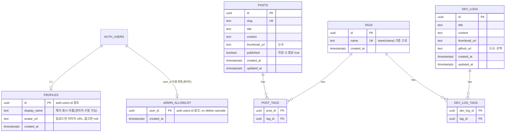

# profile0919.site PRD

> 작성일: 2026-10-06 | 대상: 1인 개발자(관리자 본인) | 기준 코드: `main` 브랜치 작업 트리

---

## 1. Executive Summary & User Stories

### 1.1 요약

| 항목 | 내용 |
|------|------|
| **도메인** | profile0919.site |
| **목적** | 미리 등록된 관리자 계정(아이디/비밀번호) 한 명만 콘텐츠를 관리하고, 일반 방문자는 읽기만 가능한 개인 프로필 / 블로그 / 개발 일기 사이트. 헤더 중앙에는 프로필(DB 값)을 보여주고, 메인 페이지에서만 현재 시간·날씨 분위기 연출을 추가한다. 메인은 헤더 + 바디(블로그 목록 + 개발 일기 영역) 한 화면으로 구성 |
| **타겟 사용자** | 방문자(Guest): 로그인 없이 글과 개발 일기를 읽는 사람 · 관리자(Admin): Supabase에 미리 등록되고 허용 목록에 올라 있는 관리자 계정(아이디/비밀번호) 소유자 1인 |
| **핵심 원칙** | ① 권한은 UI가 아니라 DB(RLS)에서 최종 강제 ② 가입 개념 없음(신규 가입 비활성화 + 로그인 직후 허용 목록 외 계정은 세션 폐기, 가입이 실수로 열려도 RLS가 쓰기를 거부) ③ 방문자 화면에는 관리 UI가 렌더링되지 않음 |

### 1.2 사용자 스토리

**방문자(Guest)**

| ID | 스토리 | 인수 조건 |
|----|--------|-----------|
| US-G1 | 방문자로서 헤더에서 프로필과(메인 페이지에서는) 지금의 시간·날씨 분위기를 보고 싶다 | 모든 페이지 헤더 중앙에 프로필 이미지/이름(DB 값)이 표시된다. 메인 페이지 헤더에는 현재 시각(XX:XX)과 날씨(맑음/흐림/비/눈)에 맞는 하늘이 추가로 표시되고, 다른 페이지는 연출 없는 압축형 헤더다 |
| US-G2 | 방문자로서 한 화면에서 최신 글부터 훑어보고 싶다 | 메인 페이지에서 블로그 목록이 최신순, 페이지당 4개, 하단 번호 버튼(1, 2, 3, 4…)으로 보인다 |
| US-G3 | 방문자로서 관심 주제의 글만 보고 싶다 | 좌측 태그 사이드바(전체 보기 개수 + 태그별 개수)를 누르면 해당 태그 글만 필터링된다 |
| US-G4 | 방문자로서 글 전문을 읽고 싶다 | 카드를 누르면 게시글 상세 페이지로 이동한다 |
| US-G5 | 방문자로서 개발 일기를 카드로 훑고 읽고 싶다 | 메인 하단 개발 일기 영역에 최신 4개 카드가 스크롤 없이 모두 보이고(데스크톱 4열, 모바일 2x2), [개발 일기 더 보기]로 목록, 카드로 상세를 연다 |
| US-G6 | 방문자로서 개발 일기에 연결된 GitHub 저장소로 이동하고 싶다 | 저장소 URL이 입력된 카드/상세에만 GitHub 링크가 보이고 새 탭으로 열린다 |
| US-G7 | 방문자로서 관리 기능은 보이지 않길 원한다 | [로그인] 외에 [작성]/[프로필]/[게시]/[수정]/[삭제]/[로그아웃]이 DOM에 존재하지 않는다 |

**관리자(Admin)**

| ID | 스토리 | 인수 조건 |
|----|--------|-----------|
| US-A1 | 관리자로서 헤더 우측 [로그인]을 눌러 로그인 페이지에서 아이디/비밀번호로 로그인하고 싶다 | [로그인]은 로그인 페이지로 이동하고, 미리 등록된 허용 계정의 아이디/비밀번호만 통과해 원래 보던 페이지(없으면 메인)로 복귀한다. 그 외는 "아이디 또는 비밀번호가 올바르지 않습니다"가 폼에 표시된다 |
| US-A2 | 관리자로서 블로그 글을 작성하고 싶다 | 헤더 [작성] → 썸네일, 제목, 본문, 태그 입력 후 [저장] 한 번으로 즉시 공개된다 |
| US-A3 | 관리자로서 기존 글을 고치고 싶다 | 상세 페이지 맨 아래 [수정] → 수정 페이지에서 [저장] |
| US-A4 | 관리자로서 글/일기를 삭제하고 싶다 | 확인 다이얼로그 후 삭제된다 |
| US-A5 | 관리자로서 개발 일기를 게시하고 싶다 | 개발 일기 영역 우측 [게시] → 썸네일, 제목, 본문, 태그, GitHub 저장소 URL(선택) 입력 후 [저장] |
| US-A6 | 관리자로서 태그를 검색해 고르거나 새로 추가하고 싶다 | 기존 태그는 검색해 선택하고, 새 태그는 직접 입력 후 [추가]를 누르면 tags에 등록된다(블로그·개발 일기 공용) |
| US-A7 | 관리자로서 허용 목록 외 계정은 로그인되지 않고 쓰기에도 실패하길 원한다 | 신규 가입은 비활성화되어 있고, 허용 목록 외 계정은 로그인 직후 세션이 폐기되며, 설령 세션이 있어도 RLS가 쓰기를 거부한다 |
| US-A8 | 관리자로서 헤더의 표시 이름과 프로필 이미지를 직접 바꾸고 싶다 | 로그인하면 헤더 우측에 [작성]과 [프로필] 버튼이 보이고, [프로필]을 누르면 프로필 수정 페이지에서 표시 이름·이미지(업로드/교체/제거)를 고쳐 [저장]하면 헤더 중앙 프로필에 바로 반영된다. 로그인할 때마다 수정값이 덮어써지지 않는다 |

### 1.3 사용자 여정

```
[방문자 흐름]
1. 메인 페이지 (헤더 + 바디 한 화면, 별도 푸터 없음)
   · 헤더(확장형, 메인에서만): 프로필(이미지/이름, DB 값), 현재 시각·날씨 하늘, 우측 [로그인]
   · 바디: 좌 태그 사이드바 + 중앙 게시글 목록(4개/페이지) → 아래쪽 개발 일기 영역(최신 4개 카드를 스크롤 없이 그리드로 표시)
   ↓ 태그 클릭 → 같은 페이지에서 해당 태그로 필터링 (1페이지로 리셋)
   ↓ 페이지 번호 클릭 → 해당 페이지 표시
   ↓ 게시글 카드 클릭
2. 게시글 상세 → [목록으로] → 1번 (선택했던 태그/페이지 유지)

   개발 일기 카드 클릭 → 개발 일기 상세 → [목록으로] → 개발 일기 목록
   개발 일기 영역 [개발 일기 더 보기] → 개발 일기 목록 → 카드 → 개발 일기 상세
   GitHub 링크가 있는 카드 → GitHub 저장소(새 탭)

   (게시글 상세·개발 일기 페이지 등 메인 외 모든 페이지는 날씨 연출 없는 압축형 헤더. 프로필·버튼 위치는 동일)

   (구 `/posts` 주소 접근 → 메인 페이지로 자동 리디렉션)

[관리자 흐름]
1. 헤더 우측 [로그인] 클릭 → 로그인 페이지 (아이디(이메일)·비밀번호 입력 폼)
   · 이미 관리자로 로그인된 상태로 접근하면 메인 페이지로 리디렉션
2. [로그인] 제출 → 서버 액션: 입력 검증 → 이메일/비밀번호 로그인 → 허용 목록 검사(`is_admin()`)
   [성공] → 원래 보던 페이지(`next`, 내부 경로만) 또는 메인 페이지로 이동, 헤더 우측이 [작성] + [프로필] + [로그아웃]으로 전환, 개발 일기 영역에 [게시] 표시
   [실패: 틀린 아이디/비밀번호 또는 허용 목록 외 계정(즉시 세션 폐기)] → 로그인 페이지에 머무르며 폼에 "아이디 또는 비밀번호가 올바르지 않습니다" 표시 (두 경우 같은 문구)
3. 헤더 [작성] → 게시글 작성 페이지 → [저장] → 게시글 상세 (즉시 공개)
4. 게시글 상세 맨 아래 [수정] → 게시글 수정 페이지 → [저장] → 게시글 상세
5. 개발 일기 영역(또는 개발 일기 목록) [게시] → 개발 일기 작성 페이지 → [저장] → 개발 일기 상세
   → 맨 아래 [수정] → 개발 일기 수정 페이지 → [저장] → 개발 일기 상세
6. 헤더 [프로필] → 프로필 수정 페이지 → 표시 이름/이미지 수정 → [저장] → 메인 페이지 (헤더 중앙 프로필에 즉시 반영) / [취소] → 메인 페이지
7. 헤더 [로그아웃] → 메인 페이지

[보호 규칙]
- 작성/수정/프로필 수정 페이지에 비관리자 접근 → 로그인 페이지로 리디렉션(`/login?next=<원래 경로>`, 로그인 페이지에 "관리자 로그인이 필요합니다" 안내 표시) → 로그인 성공 시 원래 경로로 복귀 (조회 불가 slug/id는 404)
```

---

## 2. System Architecture & Database Schema

### 2.1 아키텍처

```
브라우저
  ├─ Server Component (기본): 목록/상세 SSR, Supabase 서버 클라이언트로 조회, 헤더 프로필 조회,
  │                           날씨 조회(메인 페이지 라우트 그룹에서만)
  ├─ Client Component: 하늘·시계(SkyHeader, 메인 전용), 테마 토글, 로그인 폼(상태/오류 표시),
  │                    [로그아웃] 버튼, 폼 입력/미리보기, 태그 검색·추가, 프로필 이미지 선택/미리보기,
  │                    썸네일·프로필 이미지 Storage 직접 업로드(관리자 세션)
  └─ Server Action: 로그인(signInWithPassword → is_admin() 검사 → profiles 최초 생성)·로그아웃,
                    글/일기/태그/프로필 저장·삭제 (관리자 검증 후 실행, 이미지 파일 본문은 받지 않음)

Next.js 16 (App Router)
  ├─ proxy.ts: 모든 요청에서 Supabase 세션 쿠키 갱신 (구현됨)
  └─ getWeather(): 서버 전용 날씨 조회 함수 (아래 2.1.1, 메인 페이지에서만 호출)

Supabase
  ├─ Auth: 이메일+비밀번호 로그인(관리자 계정은 대시보드에서 미리 생성), 신규 가입 허용 끔(필수), 다른 provider 비활성화
  ├─ Database(PostgreSQL): 테이블 + RLS + is_admin() 함수
  └─ Storage: thumbnails 버킷 (공개 읽기 / 관리자 쓰기, 글 썸네일 + 프로필 이미지)

외부 API: Open-Meteo (서버에서만 호출, 브라우저 직접 호출 없음)
```

- **권한 3중 방어**: ① 가입 비활성화 + 로그인 직후 `is_admin()` 검사(허용 목록 외 계정은 세션 폐기) ② 서버 액션/관리자 페이지의 관리자 재검증 ③ RLS·Storage 정책(최종 방어선). UI 숨김은 편의일 뿐 보안 수단이 아니다.
- **이미지 업로드는 브라우저에서 Supabase Storage로 직접 올린다.** Next.js 16 서버 액션 요청 본문은 기본 1MB로 제한되고(`serverActions.bodySizeLimit` 문서), Vercel 서버리스 함수에도 요청 본문 크기 제한이 있어(구현 시 공식 문서로 한도 확인) 최대 5MB 이미지를 서버 액션이나 라우트로 중계하지 않는다. Storage RLS가 관리자만 쓰기를 허용하므로 클라이언트 업로드도 안전하며, 파일 크기·형식은 버킷의 5MB·MIME 제한이 서버 측에서 강제한다. 저장 서버 액션은 전달받은 이미지 URL이 이 버킷의 허용 경로(`posts/`, `dev-logs/`, `profile/`)인지 검증한 뒤 DB에 기록한다.
- **가입 차단은 필수 설정**: 공개 anon 키로 누구나 `signUp`을 호출할 수 있으므로 Supabase 대시보드에서 신규 가입 허용(Allow new users to sign up)을 반드시 끈다. 설정이 실수로 켜져 계정이 생겨도 `admin_allowlist`에 없으면 `is_admin()`이 false이므로 RLS가 쓰기를 거부한다(이중 안전장치).
- **헤더 레이아웃 분리**: 헤더는 루트 레이아웃이 아니라 라우트 그룹 레이아웃에서 렌더링한다. 메인 페이지 그룹은 확장형 헤더 + 날씨 조회, 나머지 그룹은 압축형 헤더(날씨 조회 없음). 404/오류 화면은 압축형 헤더를 직접 렌더링한다.
- **proxy.ts는 세션 갱신 전용**으로 유지한다. Next.js 16에서 `middleware`는 `proxy`로 이름이 바뀌었으며, proxy는 렌더와 분리되어 실행되므로 권한 판단의 단일 근거로 쓰지 않고 페이지/서버 액션에서 재검증한다.
- Next.js 16에서 `params`, `searchParams`는 Promise이다 (`await` 필요). 목록의 태그/페이지 상태는 `searchParams`(`?tag=…&page=…`)로 표현해 서버에서 렌더링한다.

#### 2.1.1 날씨 데이터 흐름

**날씨는 메인 페이지(`/`)에서만 조회·표시한다.** 다른 모든 페이지는 날씨 연출이 없는 압축형 헤더를 쓰며 `getWeather()`를 호출하지 않으므로 불필요한 외부 API 호출이 없다.

**Open-Meteo란?**

- 오픈소스 무료 날씨 API로, **API 키와 회원가입이 필요 없다.**
- 각국 기상청(NOAA, DWD, Météo-France 등)의 예보 모델 데이터를 합쳐 제공한다.
- 현재 날씨, 시간별/일별 예보, 일출·일몰 시각, WMO 날씨 코드(맑음/흐림/비/눈 등 분류)를 JSON으로 반환한다.
- 비상업적 이용은 무료이며 호출 한도와 이용 조건은 구현 시점에 공식 문서로 확인한다. 사용 시 CC BY 4.0 출처 표기가 필요하다.
- 이 프로젝트에서는 **현재 날씨 코드(`weather_code`)와 일출·일몰 시각(`sunrise`/`sunset`)** 두 가지만 사용한다.

```
설정값(siteConfig.weather: 위도/경도/시간대/표시명, 서울 확정: 37.5665, 126.9780, Asia/Seoul)
  ↓
[서버] getWeather() — 메인 페이지 라우트 그룹 레이아웃에서만 호출. Open-Meteo 호출 (current weather_code + daily sunrise/sunset, timezone=Asia/Seoul)
  · fetch 옵션 `next: { revalidate: 1800 }` 로 30분 재검증 캐시
  · 3초 타임아웃, 실패/비정상 응답/매핑 불가 → null 반환(throw 하지 않음, 오류는 서버 로그만)
  ↓ 정규화: { condition: "clear" | "cloudy" | "rain" | "snow", sunrise: "HH:MM", sunset: "HH:MM" }
[서버] 메인 페이지의 확장형 Header가 Suspense로 감싼 채 props로 전달 (날씨 지연이 본문 렌더를 막지 않음, fallback = 폴백 하늘)
  ↓
[클라이언트] SkyHeader: 현재 시각(Asia/Seoul)으로 시계 XX:XX·하늘색·해/달 위치를 계산하고 CSS 애니메이션으로 연출
  · weather가 null이면 폴백: 일출 06:00 / 일몰 18:00 / 맑음으로 시간대만 반영
```

- **Next.js 16 캐싱 근거**: 이 프로젝트는 `cacheComponents`가 **비활성**이므로 `node_modules/next/dist/docs/01-app/02-guides/caching-without-cache-components.md`의 기존 모델을 따른다. `fetch`는 기본적으로 캐시되지 않으므로 `next.revalidate`를 명시해야 하고(`fetch` 문서의 `options.next.revalidate`), 헤더가 쿠키(관리자 여부)를 읽어 페이지가 요청 시점 렌더가 되더라도 이 fetch 캐시는 렌더 방식과 별개로 동작한다. 날씨 fetch는 메인 페이지 요청에서만 발생한다. 외부 호출은 캐시 유효 시간(30분)당 최소화되지만 배포 환경(리전/인스턴스)별 캐시 특성상 정확한 횟수는 보장하지 않는다. 추후 `cacheComponents`를 켜면 `use cache` + `cacheLife` 방식으로 교체해야 한다(CLAUDE.md의 비활성 상태 전제).
- **일출/일몰은 "HH:MM" 문자열만 사용**한다. 캐시가 자정을 넘겨 최대 30분 낡아도 일출·일몰은 하루 사이 분 단위로만 변하므로 영향이 미미하다.
- **서버 조회 + 클라이언트 분리 이유**: 외부 API 호출·캐시는 서버에서 한 번만 하고(키/CORS/요청량 통제), 매분 바뀌는 시계·해 위치·애니메이션은 클라이언트에서 계산해 서버 재렌더 없이 갱신한다. 하이드레이션 불일치를 피하려고 마운트 전에는 `--:--`와 중립 하늘을 렌더한다.
- Open-Meteo 응답의 WMO `weather_code` 매핑: 0·1 → 맑음, 2·3·45·48 → 흐림, 51–67·80–82·95–99 → 비, 71–77·85–86 → 눈.

### 2.2 라우트 정리

기존 코드는 `/posts`(목록)이고 요청서는 `/post/create`(작성)로 단수/복수가 섞여 있다. **복수형으로 통일**하고 `/post/create`는 `/posts/new`로 대체한다. 메인(`/`)이 블로그 목록을 흡수하므로 목록 전용 라우트는 두지 않는다.

| 화면 | 최종 경로 | 현재 상태 | 비고 |
|------|-----------|-----------|------|
| 메인 페이지 | `/` | 임시 자리 표시자 | 확장형 헤더(날씨 연출) + 바디(블로그 목록 + 개발 일기 영역). `?tag=…&page=…`. 날씨 조회는 이 라우트에서만 |
| (구) 블로그 목록 | `/posts` | 단순 목록 구현됨 | `/`로 리디렉션(`next.config.ts`의 `redirects`, 쿼리는 자동으로 목적지에 전달됨. 처음에는 `permanent: false`(307)로 두고 안정화 후 영구(308)로 전환 — 308은 브라우저가 영구 캐시한다). 목록 로직은 메인으로 이식 후 페이지 삭제 |
| 게시글 상세 | `/posts/[slug]` | 없음 | slug 사용 |
| 게시글 작성 | `/posts/new` | 없음 | 요청서의 `/post/create` 대체 |
| 게시글 수정 | `/posts/[slug]/edit` | 없음 | |
| 개발 일기 목록 | `/dev-logs` | 없음 | 메인 개발 일기 영역의 [개발 일기 더 보기] 대상 |
| 개발 일기 상세 | `/dev-logs/[id]` | 없음 | |
| 개발 일기 작성 | `/dev-logs/new` | 없음 | |
| 개발 일기 수정 | `/dev-logs/[id]/edit` | 없음 | |
| 프로필 수정 | `/profile/edit` | 없음 | 관리자 전용. 표시 이름·프로필 이미지 수정 |
| 로그인 | `/login` | 없음 | 아이디(이메일)/비밀번호 폼. `?next=` 지원. 관리자 로그인 상태면 메인으로 리디렉션. sitemap 제외 |

- 회원가입·비밀번호 찾기 화면은 만들지 않는다(비밀번호 변경은 Supabase 대시보드에서만, 3.2 참조).
- `/posts/new`는 `[slug]` 동적 세그먼트보다 정적 세그먼트가 우선하므로 충돌하지 않는다. 단, **`new`는 예약어이므로 slug로 사용할 수 없다** (검증 규칙에 포함).
- **외부 날씨 API는 메인 페이지에서만, 서버에서만 호출한다.** 브라우저에는 가공된 값(`condition`, `sunrise`, `sunset`)만 전달된다.
- **`NAV_LINKS` / sitemap 영향**: 헤더 NAV 메뉴(홈/블로그/개발 일기)를 폐기하므로 `NAV_LINKS`는 헤더에서 쓰지 않는다. `sitemap.ts`가 이를 사용하므로 정적 경로 목록 용도로만 `/`, `/dev-logs` 두 항목을 남기고 `/posts`는 제거한다(이름을 정적 경로 목록에 맞게 바꿀지는 구현 시 결정). 동적 URL `/posts/[slug]`, `/dev-logs/[id]`는 Supabase 조회로 sitemap에 추가하고, 로그인/작성/수정/프로필 수정 경로는 sitemap에서 제외한다. `nav-link.tsx`는 사용처가 없어지면 삭제한다.

### 2.3 ERD



| 테이블 | 상태 | 설명 |
|--------|------|------|
| `posts` | **변경** (`thumbnail_url` 추가, `published` 기본값 true, RLS 강화) | slug 유지. `published`는 항상 true로 저장(아래 2.6 참조) |
| `tags` | 신규 | 태그 이름. **블로그와 개발 일기가 공유**, 대소문자 무시 고유 |
| `post_tags` | 신규 | posts↔tags N:M, 복합 PK. 사이드바 개수·필터의 기준 |
| `dev_logs` | 신규 | 개발 일기. 선택 필드 `github_url` 포함 |
| `dev_log_tags` | 신규 | dev_logs↔tags N:M, 복합 PK. 카드/상세 표시 전용(필터 없음) |
| `profiles` | 신규 | 관리자 표시 정보(`display_name`, `avatar_url`). 권한 판단에는 쓰지 않음. **헤더 중앙 프로필의 출처**(SELECT 공개). 로그인 성공 직후 행이 없을 때만 생성(이메일 로컬 파트 / 이미지 null)되고 이후 프로필 수정 페이지에서만 변경 |
| `admin_allowlist` | 신규 | 허용 계정 목록(`auth.users` 참조). 클라이언트 직접 접근 불가. 관리자 계정을 대시보드에서 만든 뒤 user id를 1회 시드 |
| Storage `thumbnails` | 신규 | 이미지 버킷. 글 썸네일(`posts/`, `dev-logs/`)과 프로필 이미지(`profile/`)를 함께 저장 |

### 2.4 SQL: 관리자 판별 (신규 마이그레이션)

> 기존 마이그레이션 `20261006094502_create_posts_table.sql`은 수정하지 않고, 새 마이그레이션으로 정책을 교체한다. 컬럼·테이블 정의는 아래 순서(admin_allowlist → is_admin() → profiles와 정책)대로 한 파일(또는 논리 단위별 여러 파일)로 작성한다.

```sql
-- 허용 계정 목록 (Supabase Auth 사용자 id 기준, 계정 삭제 시 함께 삭제)
create table public.admin_allowlist (
  user_id uuid primary key references auth.users (id) on delete cascade,
  created_at timestamptz not null default now()
);
alter table public.admin_allowlist enable row level security;
-- 정책을 만들지 않는다: anon/authenticated는 직접 조회 불가
revoke all on public.admin_allowlist from anon, authenticated;

-- (순서 주의) is_admin()은 profiles의 RLS 정책보다 먼저 만들어야 한다. 정책 생성 시점에 함수가 존재해야 하기 때문이다.

-- 현재 로그인 사용자가 허용 목록에 있는지 판별.
-- user_metadata는 사용자가 수정할 수 있으므로 쓰지 않고, 서버만 쓸 수 있는 admin_allowlist의 user_id로 대조한다.
-- 가입 허용 설정이 실수로 켜져 계정이 생겨도 허용 목록에 없으면 false이므로 RLS가 쓰기를 막는다(이중 안전장치).
create or replace function public.is_admin()
returns boolean
language sql
stable
security definer
set search_path = ''
as $$
  select exists (
    select 1
    from public.admin_allowlist
    where user_id = (select auth.uid())
  );
$$;
revoke execute on function public.is_admin() from public;
grant execute on function public.is_admin() to anon, authenticated;

-- 관리자 표시용 프로필 (권한 근거 아님). 헤더 중앙 프로필의 출처
create table public.profiles (
  id uuid primary key references auth.users (id) on delete cascade,
  -- 표시 이름. 로그인 성공 직후 행이 없을 때만 생성하며 기본값은 이메일 로컬 파트(30자 초과 시 잘라서 저장), 이후 프로필 수정 페이지에서만 변경
  display_name text not null check (char_length(btrim(display_name)) between 1 and 30),
  -- 프로필 이미지 공개 URL. 기본 null(설정값/기본 이미지 폴백), 업로드 시 thumbnails 버킷의 profile/ 경로 URL, 제거하면 null
  avatar_url text,
  created_at timestamptz not null default now()
);
alter table public.profiles enable row level security;
-- 방문자도 헤더에서 조회해야 하므로 SELECT 공개
create policy "profiles_select_public" on public.profiles for select using (true);
-- 로그인한 관리자 본인 행만 작성/수정 가능 (로그인 서버 액션의 최초 생성 + 프로필 수정 페이지, service role 키 미사용)
create policy "profiles_insert_self_admin" on public.profiles
  for insert with check (id = (select auth.uid()) and (select public.is_admin()));
create policy "profiles_update_self_admin" on public.profiles
  for update using (id = (select auth.uid()) and (select public.is_admin()))
  with check (id = (select auth.uid()) and (select public.is_admin()));

```

### 2.5 SQL: 테이블 변경/신규

```sql
-- 기존 set_updated_at 함수의 search_path 고정 (원격 보안 어드바이저 경고 해소, dev_logs 트리거도 이 함수를 사용)
alter function public.set_updated_at() set search_path = '';

-- posts 변경: 썸네일 경로(Storage 공개 URL 또는 객체 경로)
alter table public.posts add column thumbnail_url text;
-- 저장하면 즉시 공개되므로 기본값을 true로 맞춘다(앱도 저장 시 항상 true를 명시)
alter table public.posts alter column published set default true;

-- 블로그와 개발 일기가 공유하는 태그
create table public.tags (
  id uuid primary key default gen_random_uuid(),
  name text not null check (char_length(name) between 1 and 20 and name = btrim(name)),
  created_at timestamptz not null default now()
);
-- 대소문자만 다른 중복을 막는다(표기는 최초 등록값 유지)
create unique index tags_name_lower_key on public.tags (lower(name));

-- 태그 등록: 대소문자 무시 중복이면 기존 태그를 그대로 반환한다.
-- supabase-js의 upsert(onConflict)는 표현식 인덱스(lower(name))를 지정할 수 없어 함수로 처리한다.
-- security invoker이므로 RLS가 적용되어 관리자만 실제로 등록할 수 있다.
create function public.add_tag(tag_name text)
returns public.tags
language plpgsql
security invoker
set search_path = ''
as $$
declare
  result public.tags;
begin
  insert into public.tags (name) values (btrim(tag_name))
  on conflict ((lower(name))) do nothing;

  select * into result from public.tags where lower(name) = lower(btrim(tag_name));
  return result;
end;
$$;
revoke execute on function public.add_tag(text) from public, anon;
grant execute on function public.add_tag(text) to authenticated;

create table public.post_tags (
  post_id uuid not null references public.posts (id) on delete cascade,
  tag_id uuid not null references public.tags (id) on delete cascade,
  primary key (post_id, tag_id)
);
create index post_tags_tag_id_idx on public.post_tags (tag_id);

create table public.dev_logs (
  id uuid primary key default gen_random_uuid(),
  title text not null,
  content text not null,
  thumbnail_url text,
  -- 선택 입력. 입력 시 GitHub 저장소 주소만 허용(앱에서도 동일 검증)
  github_url text check (github_url is null or github_url ~* '^https://github\.com/'),
  created_at timestamptz not null default now(),
  updated_at timestamptz not null default now()
);

-- 개발 일기 ↔ 태그 (tags는 post_tags와 공유)
create table public.dev_log_tags (
  dev_log_id uuid not null references public.dev_logs (id) on delete cascade,
  tag_id uuid not null references public.tags (id) on delete cascade,
  primary key (dev_log_id, tag_id)
);
create index dev_log_tags_tag_id_idx on public.dev_log_tags (tag_id);

create trigger dev_logs_set_updated_at
  before update on public.dev_logs
  for each row execute function public.set_updated_at();

create index posts_published_created_at_idx
  on public.posts (published, created_at desc);
```

### 2.6 SQL: RLS 정책

**현재 정책의 문제**: `authenticated_users_manage_posts`가 `auth.uid() is not null`만 검사하므로, Supabase Auth에 계정이 생성된 누구나 글을 쓰고 지울 수 있다. 아래처럼 **`is_admin()` 한정으로 교체**한다.

```sql
-- ── posts ──────────────────────────────────────────
drop policy if exists "authenticated_users_manage_posts" on public.posts;
drop policy if exists "published_posts_are_public" on public.posts;

-- 공개 글(published = true)은 누구나, 비공개 행은 관리자만 조회.
-- 앱은 저장 시 항상 published = true로 기록하므로 방문자에게 모든 글이 보인다.
-- 컬럼은 기존 마이그레이션과의 호환 및 향후 비공개 처리 여지로 유지하며,
-- 이 정책은 직접 SQL 등으로 비공개 처리된 행이 노출되는 것을 막는 방어선이다.
create policy "posts_select" on public.posts
  for select using (published = true or (select public.is_admin()));
create policy "posts_insert_admin" on public.posts
  for insert with check ((select public.is_admin()));
create policy "posts_update_admin" on public.posts
  for update using ((select public.is_admin())) with check ((select public.is_admin()));
create policy "posts_delete_admin" on public.posts
  for delete using ((select public.is_admin()));

-- ── tags ───────────────────────────────────────────
alter table public.tags enable row level security;
create policy "tags_select_public" on public.tags for select using (true);
create policy "tags_insert_admin" on public.tags
  for insert with check ((select public.is_admin()));
create policy "tags_update_admin" on public.tags
  for update using ((select public.is_admin())) with check ((select public.is_admin()));
create policy "tags_delete_admin" on public.tags
  for delete using ((select public.is_admin()));

-- ── post_tags ──────────────────────────────────────
alter table public.post_tags enable row level security;
-- 공개된 글의 태그 매핑만 공개 (비공개 처리된 글의 태그 노출 방지)
create policy "post_tags_select" on public.post_tags
  for select using (
    (select public.is_admin())
    or exists (select 1 from public.posts p where p.id = post_id and p.published)
  );
create policy "post_tags_insert_admin" on public.post_tags
  for insert with check ((select public.is_admin()));
create policy "post_tags_delete_admin" on public.post_tags
  for delete using ((select public.is_admin()));

-- ── dev_logs ───────────────────────────────────────
alter table public.dev_logs enable row level security;
create policy "dev_logs_select_public" on public.dev_logs for select using (true);
create policy "dev_logs_insert_admin" on public.dev_logs
  for insert with check ((select public.is_admin()));
create policy "dev_logs_update_admin" on public.dev_logs
  for update using ((select public.is_admin())) with check ((select public.is_admin()));
create policy "dev_logs_delete_admin" on public.dev_logs
  for delete using ((select public.is_admin()));

-- ── dev_log_tags ───────────────────────────────────
alter table public.dev_log_tags enable row level security;
-- 개발 일기는 전부 공개이므로 매핑도 전체 공개
create policy "dev_log_tags_select_public" on public.dev_log_tags for select using (true);
create policy "dev_log_tags_insert_admin" on public.dev_log_tags
  for insert with check ((select public.is_admin()));
create policy "dev_log_tags_delete_admin" on public.dev_log_tags
  for delete using ((select public.is_admin()));
```

- `(select public.is_admin())` 형태로 감싸 행마다 재평가되지 않게 한다(initPlan 캐싱).
- `post_tags`, `dev_log_tags`는 UPDATE 정책이 없다. 태그 변경은 삭제 후 재삽입으로 처리하되, **글/일기 행 저장과 태그 매핑 갱신은 DB 함수(`save_post`, `save_dev_log`, security invoker)로 한 트랜잭션에 처리**한다. 서버 액션에서 따로 호출하면 중간 실패 시 글만 저장되고 태그가 사라지는 불일치가 생기기 때문이다. 함수 본문 SQL은 구현 단계(Phase 6, 8)에서 작성한다.
- `tags`는 블로그·개발 일기가 공유하므로 정책을 공유한다(SELECT 전체 공개, 쓰기 관리자 한정). 사이드바 개수는 `post_tags`만 집계하고 `dev_log_tags`는 집계하지 않는다.

### 2.7 관리자 시드와 가입 차단 (대시보드 수동 설정)

이 절의 작업은 마이그레이션 파일이 아니라 Supabase 대시보드에서 수행하며, 개인 정보(이메일, user id)를 저장소에 커밋하지 않는다.

1. Authentication > Users > Add user로 관리자 계정 1개 생성(이메일 형식 ID + 강한 비밀번호, 이메일 확인 자동 처리).
2. Authentication > Sign In / Providers에서 **Allow new users to sign up을 끄고**(필수) GitHub 등 다른 provider를 비활성화하고, **Anonymous sign-ins도 꺼 둔다**(익명 사용자도 `authenticated` 역할을 받기 때문이며 기본값은 꺼짐). 설정 이름과 위치는 구현 직전에 대시보드에서 확인한다.
3. 생성된 사용자의 id(uuid)를 복사해 SQL Editor에서 1회 실행: `insert into public.admin_allowlist (user_id) values ('<관리자 user id>');`

### 2.8 SQL: Storage 버킷 정책

```sql
-- 공개 읽기 버킷, 5MB 제한, 이미지 MIME만 허용
insert into storage.buckets (id, name, public, file_size_limit, allowed_mime_types)
values (
  'thumbnails', 'thumbnails', true, 5242880,
  array['image/png', 'image/jpeg', 'image/gif', 'image/webp']
);

-- 공개 버킷은 URL로 바로 제공되므로 방문자용 SELECT 정책을 만들지 않는다(만들면 누구나 파일 목록을 조회할 수 있다).
-- 관리자의 목록 조회·삭제·교체 동작을 위해 관리자 전용 SELECT만 둔다.
create policy "thumbnails_select_admin" on storage.objects
  for select using (bucket_id = 'thumbnails' and (select public.is_admin()));
create policy "thumbnails_insert_admin" on storage.objects
  for insert with check (bucket_id = 'thumbnails' and (select public.is_admin()));
create policy "thumbnails_update_admin" on storage.objects
  for update using (bucket_id = 'thumbnails' and (select public.is_admin()))
  with check (bucket_id = 'thumbnails' and (select public.is_admin()));
create policy "thumbnails_delete_admin" on storage.objects
  for delete using (bucket_id = 'thumbnails' and (select public.is_admin()));
```

- **프로필 이미지는 별도 버킷을 만들지 않고 기존 `thumbnails` 버킷의 `profile/` 경로를 쓴다**(공개 읽기·관리자 쓰기·5MB·이미지 MIME 정책이 그대로 적용되어 SQL 추가가 없다. 버킷 이름이 다소 어긋나지만 가장 단순하다).
- 객체 경로 규칙: `posts/{uuid}.{ext}`, `dev-logs/{uuid}.{ext}`, `profile/{uuid}.{ext}` (파일명 충돌과 한글/공백 파일명 문제 방지). 프로필 이미지는 교체할 때마다 새 uuid를 쓰므로 CDN/브라우저 캐시 문제가 없다.
- 글/일기 삭제 또는 썸네일 교체, 프로필 이미지 교체/제거 시 이전 객체를 함께 삭제한다(고아 파일 방지). `profiles.avatar_url`이 null이거나 이 버킷의 URL이 아닌 경우에는 삭제를 시도하지 않는다.

### 2.9 기술 스택

`package.json` 기준 확인값이다.

| 분류 | 기술 | 버전 | 상태 |
|------|------|------|------|
| 프레임워크 | Next.js (App Router) | 16.3.6 | 설치됨 |
| UI 라이브러리 | React / React DOM | 19.2.4 | 설치됨 |
| 언어 | TypeScript | ^5 | 설치됨 |
| 스타일 | TailwindCSS (`@tailwindcss/postcss`) | ^4 (v4) | 설치됨 |
| 컴포넌트 | shadcn/ui (`base-nova`, `@base-ui/react`) | shadcn ^4.10.0 / @base-ui/react ^1.5.0 | 설치됨 |
| 아이콘/토스트/테마 | lucide-react ^1.17.0 / sonner ^2.0.8 / next-themes ^0.4.6 | | 설치됨 |
| 날씨 | Open-Meteo Forecast API (서버 `fetch`, 키·회원가입 불필요, 메인 페이지에서만 호출, CC BY 4.0 출처 표기) | - | 신규(외부 API, 서버 전용) |
| 백엔드 | Supabase (`@supabase/supabase-js` ^2.117.2, `@supabase/ssr` ^0.12.7). 인증은 Supabase Auth 이메일+비밀번호(`signInWithPassword`) | | 설치됨 |
| 테스트 | Vitest ^5.0.1 / Playwright ^1.63.0 | | 설치됨 |
| 폼 검증 | React Hook Form + Zod (로그인 폼 포함) | 도입 시 최신 안정 버전 | **미설치(추가 예정, Phase 2에서 먼저 필요)** |
| 마크다운 | react-markdown + remark-gfm (+ 코드 하이라이트 선택) | 도입 시 최신 안정 버전 | **미설치(추가 예정)** |
| 배포 | Vercel | | 사용 중(빌드 수정 커밋 존재) |

- 추가 shadcn 컴포넌트가 필요하다. 작업 트리에서 `badge`, `dialog`, `dropdown-menu`, `textarea`가 삭제된 상태이므로 필요 시 `npx shadcn@latest add`로 재추가한다. 추가 후 `from "cn"` → `from "@/lib/utils"` 치환과 `npm uninstall cn`을 수행한다(CLAUDE.md 지침).

---

## 3. Authentication & Authorization Flow

### 3.1 관리자 식별 방식: 선택지와 권장안

| 선택지 | 장점 | 단점 |
|--------|------|------|
| A. 환경변수(`ADMIN_USER_ID`)로 보관 | 설정 간단 | **RLS(DB)에서 읽을 수 없어** 앱 코드 검사만 가능. DB 직접 호출(공개 키 노출) 시 우회 위험 |
| B. DB 테이블(`admin_allowlist`) 보관 **(권장)** | RLS와 Storage 정책에서 동일 기준 사용, 변경이 SQL 한 줄 | 초기 시드 1회 필요 |

**권장: B.** 관리자 계정의 Supabase user id(uuid)를 `admin_allowlist.user_id`에 저장한다. 관리자 계정은 대시보드에서 먼저 만들고, 그 id를 SQL Editor에서 1회 insert한다(2.7). 어떤 마이그레이션 파일에도 개인 정보를 커밋하지 않는다.

### 3.2 로그인 흐름 (헤더 [로그인] → 로그인 페이지)

```
1. 헤더 우측 [로그인] 클릭 → 로그인 페이지 (`/login`, 가드 리디렉션이면 `/login?next=<원래 경로>`)
   · 이미 관리자로 로그인된 상태면 메인 페이지로 리디렉션
2. 폼 입력: 아이디(이메일 형식), 비밀번호 → [로그인] 제출 (상태: idle / submitting(버튼 비활성+스피너) / error)
   · 클라이언트에서 Zod 검증(이메일 형식, 비밀번호 비어 있지 않음)
3. 로그인 Server Action
   a. 서버에서 Zod 재검증 (실패 시 통일 오류 문구가 아닌 필드 형식 오류만 표시)
   b. 서버 Supabase 클라이언트로 signInWithPassword (쿠키 세션은 proxy.ts / @supabase/ssr이 처리)
      [에러] → 통일 오류 문구
   c. 성공 후 is_admin() 재확인
      [false] → 즉시 signOut(세션 폐기) → 통일 오류 문구
      [true]  → profiles 처리(아래 규칙) → next(내부 경로만 허용) 또는 메인 페이지로 이동
4. 이후 모든 요청: proxy.ts가 세션 쿠키 갱신
```

- **로그인 방식**: Supabase Auth 이메일+비밀번호. Supabase는 로그인 ID를 이메일 형식으로 요구하므로 **아이디 = 이메일 형식 문자열**이다. 관리자 계정은 대시보드(Authentication > Users > Add user)에서 미리 1개 만들고(2.7), 비밀번호는 강한 값으로 설정한다. 비밀번호는 서버 액션에서만 다루고 저장·로그로 남기지 않는다.
- **통과 조건**: 미리 등록된 계정이면서 `admin_allowlist`에 있는 계정만 통과한다. 비밀번호가 맞아도 허용 목록 외 계정은 3-c에서 세션이 폐기된다(쓰기는 서버 액션 재검증과 RLS도 거부).
- **오류 문구 통일**: 틀린 아이디, 틀린 비밀번호, 허용 목록 외 계정 모두 폼 안에 **"아이디 또는 비밀번호가 올바르지 않습니다"** 한 가지로 표시해 계정 존재 여부를 노출하지 않는다. 오류 안내는 로그인 폼 안에서만 하며 토스트용 URL 파라미터(`auth_error`)와 `AuthErrorToast`는 두지 않는다(리디렉션 기반 오류 전달이 없으므로 불필요).
- **가입/재설정 없음**: 회원가입 화면과 "비밀번호 찾기"는 만들지 않는다. 비밀번호 변경은 Supabase 대시보드에서만 한다.
- **로그인 시도 제한(CAPTCHA 권장)**: Supabase Auth의 속도 제한은 IP 주소 기준이다. 로그인을 서버 액션에서 호출하면 Supabase는 방문자가 아니라 배포 서버의 IP를 보므로 방문자별 제한이 되지 않고, 반복 시도가 공유 한도를 소진해 관리자 로그인이 일시적으로 막힐 수 있다. 그래서 Supabase Auth CAPTCHA(Cloudflare Turnstile 등)를 로그인 폼에 적용하는 것을 **권장**한다(적용 방법은 구현 시 Supabase Auth CAPTCHA 가이드로 확인, 적용 여부는 6절).
- **세션 유지 기간**: Supabase 기본값을 따른다.
- **profiles 처리 규칙(덮어쓰기 금지)**: 로그인 성공(`is_admin()` 통과) 직후 서버 액션이 본인 `profiles` 행을 조회해 **없을 때만 insert**한다(`display_name` = 이메일 로컬 파트(30자 초과 시 자름), `avatar_url` = null → 설정값/기본 이미지 폴백). 행이 이미 있으면 **아무것도 하지 않는다**(프로필 수정 페이지의 수정값 보존). `upsert`로 덮어쓰지 않는다.
- `next` 리디렉션 파라미터는 `/`로 시작하는 내부 경로만 허용한다(`//`, `/\` 시작은 거부, 오픈 리디렉트 방지). 없거나 거부되면 메인 페이지로 이동한다.
- 로그인 상태(관리자)에서는 헤더 [로그인] 버튼이 렌더링되지 않고, 로그인 페이지에 직접 접근해도 메인 페이지로 리디렉션된다. 로그인 페이지 자체의 헤더에서는 [로그인] 버튼을 숨긴다.
- **가드 안내**: 관리자 가드가 `/login?next=<원래 경로>`로 보낸 경우 로그인 페이지 폼 위에 "관리자 로그인이 필요합니다" 안내 문구를 표시한다(`next`가 있을 때만).

### 3.3 서버 측 권한 검사 규칙

| 대상 | 검사 방법 |
|------|-----------|
| 로그인 서버 액션 | 가입은 대시보드에서 비활성화, `signInWithPassword` 성공 직후 `is_admin()` 검사. 허용 목록 외 계정은 즉시 `signOut`(1차 방어) |
| 작성/수정/프로필 수정 페이지 진입 | 서버에서 `getUser()`(쿠키 위조 방지를 위해 `getSession()` 단독 사용 금지)로 사용자 확인 후 `is_admin()` 호출. 비관리자는 `/login?next=<원래 경로>`로 리디렉션 |
| 저장/삭제/태그 추가/프로필 저장 서버 액션 (업로드는 브라우저→Storage 직접이며 RLS가 강제) | 실행 직전 동일 검증을 반복. 실패 시 거부 응답(2차 방어) |
| DB/Storage | RLS·Storage 정책이 최종 거부 (UI·서버 검증이 뚫리거나 가입 허용이 실수로 켜져도 안전, 3차 방어) |
| 헤더/버튼 노출 | 서버에서 관리자 여부를 계산해 Server Component에서 조건부 렌더링 (방문자 HTML에 [작성]/[프로필]/[로그아웃] 등 관리 버튼 미포함) |

### 3.4 Supabase 설정 항목

- 관리자 계정: 대시보드 Authentication > Users > Add user로 1개 생성(이메일 확인 자동 처리, 강한 비밀번호). 비밀번호 변경은 대시보드에서만.
- **신규 가입 허용(Allow new users to sign up) 끄기: 필수.** GitHub 등 다른 provider는 비활성화. 이메일 로그인(이메일+비밀번호) provider만 켠 상태를 유지한다.
- Site URL = `https://profile0919.site`(필요 시 Redirect URLs에 `http://localhost:3000/**` 등록). 이메일 비밀번호 로그인은 OAuth 콜백을 쓰지 않으므로 별도 콜백 URL 설정이 필요 없다.
- 환경 변수: `NEXT_PUBLIC_SUPABASE_URL`, `NEXT_PUBLIC_SUPABASE_PUBLISHABLE_KEY` (`.env.example`에 존재). **service role 키는 사용하지 않는다**(가정). profiles 최초 생성·수정은 2.4의 `profiles` INSERT/UPDATE 정책(`id = auth.uid()` 및 `is_admin()`)에 따라 로그인한 관리자 본인 권한으로 처리한다.
- `admin_allowlist` 시드는 2.7(대시보드 SQL Editor 1회).

---

## 4. Detailed Page/Component Specifications

### 4.1 기능 명세 (정합성 기준점)

#### MVP 핵심 기능

| ID | 기능명 | 설명 | 관련 페이지 |
|----|--------|------|-------------|
| **F001** | 게시글 목록 조회 | 메인 중앙에 최신순 4개/페이지, 하단 번호 버튼(1, 2, 3, 4…), 태그 필터 반영, 카드(썸네일·제목·요약·날짜) | 메인 페이지 |
| **F002** | 태그 사이드바 | 메인 좌측 "전체 보기 (개수)" + 태그별 개수, 기본 '전체 보기', 클릭 시 필터. **개수·필터는 블로그 글 기준만** | 메인 페이지 |
| **F003** | 게시글 상세 조회 | 썸네일, 제목, 날짜, 태그, 본문(마크다운 렌더링)을 작성 내용 그대로 표시 | 게시글 상세 페이지 |
| **F004** | 게시글 작성 | 헤더 [작성] → 썸네일, 제목, 본문, 태그 입력 후 [저장] (즉시 공개) | 게시글 작성 페이지 |
| **F005** | 게시글 수정/삭제 | 상세 맨 아래 [수정] → 기존 내용 불러와 [저장], 삭제(확인 다이얼로그) | 게시글 상세 페이지, 게시글 수정 페이지 |
| **F006** | 개발 일기 조회 | 개발 일기 목록(최신순)과 상세 조회. 카드: 썸네일·제목·본문 요약·날짜·태그·(선택) GitHub 링크 | 개발 일기 목록 페이지, 개발 일기 상세 페이지 |
| **F007** | 개발 일기 작성/수정/삭제 | [게시] → 썸네일·제목·본문·태그·GitHub URL(선택) 입력 후 [저장], 상세 [수정], 삭제 | 개발 일기 작성 페이지, 개발 일기 수정 페이지, 개발 일기 상세 페이지 |
| **F009** | 썸네일 업로드 | PNG/JPG/GIF/WEBP 선택, 크기·형식 검증, 브라우저에서 Storage 직접 업로드, 미리보기, 교체 | 게시글 작성 페이지, 게시글 수정 페이지, 개발 일기 작성 페이지, 개발 일기 수정 페이지 |
| **F010** | 태그 검색·선택·추가 | 기존 tags를 검색해 선택, 새 태그는 직접 입력 후 [추가]로 tags에 등록. 게시글·개발 일기 폼 공용 | 게시글 작성 페이지, 게시글 수정 페이지, 개발 일기 작성 페이지, 개발 일기 수정 페이지 |
| **F016** | 헤더 시간·날씨 UI | **메인 페이지에서만** 서울(Asia/Seoul) 현재 시각 XX:XX, 일출~일몰에 따른 해/달 위치, 맑음·흐림·비·눈 연출, API 실패 시 시간대만 반영하는 폴백. 날씨 조회도 메인에서만 수행 | 메인 페이지 |
| **F017** | 헤더 중앙 프로필 | 모든 페이지 헤더 중앙에 프로필 이미지와 이름 표시. **값은 DB(`profiles`)에서 조회**(방문자도 조회 가능, SELECT 공개)하며 행이 없거나 값이 비면 설정값(`siteConfig.profile`)/기본 이미지로 폴백. 값의 수정은 F021 | 헤더(공통) |
| **F018** | 개발 일기 영역 | 메인 하단에 최신 4개 카드를 스크롤 없이 모두 보이게 그리드(데스크톱 4열, 모바일 2x2)로 표시, [개발 일기 더 보기] 링크, 관리자 전용 [게시] 버튼 | 메인 페이지 |
| **F019** | 개발 일기 태그 | `dev_log_tags`로 개발 일기에 태그 연결, 카드/상세에 표시만(필터 없음) | 개발 일기 작성 페이지, 개발 일기 수정 페이지, 개발 일기 상세 페이지, 개발 일기 목록 페이지, 메인 페이지 |
| **F020** | GitHub 저장소 링크(선택) | 폼에서 저장소 URL 입력(형식 검증), 입력된 경우 카드/상세에 GitHub 링크 표시 | 개발 일기 작성 페이지, 개발 일기 수정 페이지, 개발 일기 상세 페이지, 개발 일기 목록 페이지, 메인 페이지 |
| **F021** | 프로필 수정 | 헤더 [프로필] 버튼 → 프로필 수정 페이지에서 표시 이름(1~30자)과 프로필 이미지(업로드·교체·제거, PNG/JPG/GIF/WEBP 5MB 검증) 수정 후 [저장]. 저장 시 `profiles` 갱신과 캐시 재검증으로 헤더 중앙 프로필(F017)에 즉시 반영. 관리자 전용 | 프로필 수정 페이지, 헤더(공통) |

#### MVP 필수 지원 기능

| ID | 기능명 | 설명 | 관련 페이지 |
|----|--------|------|-------------|
| **F011** | 관리자 로그인/로그아웃 | 헤더 [로그인] → 로그인 페이지에서 아이디(이메일)/비밀번호 입력(Zod 검증), 서버 액션 `signInWithPassword` → `is_admin()` 확인 → 프로필 최초 생성(없을 때만), 통일 오류 문구, 헤더 [로그아웃] 별도 버튼 | 헤더(공통), 로그인 페이지 |
| **F012** | 관리자 접근 제어 | 허용 목록 검사(로그인 직후 `is_admin()` → 서버 액션 재검증 → RLS), 비관리자는 로그인 페이지로 리디렉션(`next` 복귀) | 로그인 페이지, 게시글 작성 페이지, 게시글 수정 페이지, 개발 일기 작성 페이지, 개발 일기 수정 페이지, 프로필 수정 페이지 |
| **F013** | 관리자 전용 UI 노출 | 관리자일 때만 [작성]/[프로필]/[게시]/[수정]/[삭제]/[로그아웃] 렌더링 | 헤더(공통), 메인 페이지, 게시글 상세 페이지, 개발 일기 목록 페이지, 개발 일기 상세 페이지 |
| **F014** | 테마 전환 | 다크/라이트 토글 (구현됨) | 헤더(공통) |

- F008, F015는 결번이며 재사용하지 않는다.

#### 버튼 정의

| 버튼 | 노출 조건/위치 | 동작 | 기능 ID |
|------|----------------|------|---------|
| [로그인] (헤더) | 비로그인, 헤더 우측(로그인 페이지에서는 숨김) | 로그인 페이지로 이동 | F011 |
| [로그인] (폼) | 로그인 페이지 | 아이디/비밀번호 검증 후 로그인 서버 액션 실행, 성공 시 `next` 또는 메인으로 이동 | F011, F012 |
| [작성] | 관리자, 헤더 우측 | 게시글 작성 페이지로 이동 | F004, F013 |
| [프로필] | 관리자, 헤더 우측([작성] 옆) | 프로필 수정 페이지로 이동 | F021, F013 |
| [게시] | 관리자, 개발 일기 영역 우측(개발 일기 목록 페이지에도 동일) | 개발 일기(GitHub 카드) 작성 페이지로 이동 | F007, F013 |
| [수정] | 관리자, 게시글/개발 일기 상세 맨 아래 | 해당 글의 수정 페이지로 이동 | F005, F007, F013 |
| [개발 일기 더 보기] | 전체, 메인 개발 일기 영역 우측 | 개발 일기 목록 페이지로 이동 | F006, F018 |
| [저장] | 관리자, 작성·게시·수정·프로필 수정 폼 | 검증 후 작성/게시/수정 내용 저장, 즉시 공개, 상세(프로필 수정은 메인)로 이동 | F004, F005, F007, F021 |
| [삭제] | 관리자, 상세 페이지 | 확인 다이얼로그 후 삭제 | F005, F007, F013 |
| [로그아웃] | 관리자, 헤더 우측(프로필 버튼 옆, 별도 버튼) | 세션 종료 | F011, F013 |

#### MVP 이후 (제외)

댓글, 검색, 조회수/좋아요, RSS, 다국어, 본문 내 이미지 업로드, 개발 일기 태그 필터, 예약 발행, 방문자 위치 기반 날씨, 태그 관리 화면

### 4.2 메뉴 구조

```
📱 profile0919 헤더 (모든 페이지 공통)
├── 좌측: 사이트명(→ 메인 페이지)
│   └── 🌗 테마 전환 - F014
├── 중앙: 프로필 이미지 / 이름 (DB 값) - F017
└── 우측 (상태별)
    ├── 비로그인: [로그인] → 로그인 페이지 - F011
    └── 관리자: [작성] - F004, F013 · [프로필] → 프로필 수정 - F021, F013 · [로그아웃] - F011, F013

🔑 로그인 페이지 (비로그인, 헤더 [로그인] 또는 관리자 가드 리디렉션으로 진입)
└── 아이디(이메일)/비밀번호 폼 + [로그인] - F011, F012

🏠 메인 페이지 (헤더 + 바디 한 화면. 헤더에 홈/블로그/개발 일기 메뉴 없음)
├── 헤더 확장형(메인 전용): 현재 시각 XX:XX · 날씨 하늘 - F016 (그 외 페이지는 연출 없는 압축형)
├── 좌측: 태그 사이드바 - F002
├── 중앙: 게시글 목록 + 하단 1, 2, 3, 4 페이지 버튼 - F001
└── 하단: 개발 일기 영역(최신 4개 카드 그리드, 스크롤 없음) - F018 (카드의 태그/GitHub 링크: F019, F020)
    ├── [개발 일기 더 보기] → 개발 일기 목록 - F006
    └── [게시] (관리자만, 영역 우측) - F007, F013

🔐 페이지 내 버튼 (관리자만)
├── 게시글 상세 맨 아래 [수정]/[삭제] - F005, F013
├── 개발 일기 상세 맨 아래 [수정]/[삭제] - F007, F013
├── 개발 일기 목록 [게시] - F007, F013
├── 폼 공통 [저장]/[취소] - F004, F005, F007 · 썸네일 - F009 · 태그 [추가] - F010
└── 프로필 수정 [저장]/[취소] · 프로필 이미지 업로드/제거 - F021
```

- **기존 헤더 NAV(홈/블로그/개발 일기) 처리 방침**: 폐기한다. 헤더 중앙은 프로필이고 메인 페이지가 블로그 목록과 개발 일기 영역을 모두 담으므로 메뉴가 중복된다. 홈 복귀는 사이트명 클릭, 개발 일기 목록 진입은 영역의 [개발 일기 더 보기]로 대체한다.

### 4.3 페이지 접근성 확인표

| 페이지 | 메뉴/진입 경로 | 접근 권한 |
|--------|----------------|-----------|
| 메인 페이지 | 직접 접근, 헤더 사이트명, 상세의 [목록으로], 구 `/posts` 리디렉션, 로그아웃/프로필 수정 후 이동, 로그인 성공(`next` 없음) 후 이동 | 전체 |
| 로그인 페이지 | 헤더 [로그인], 관리자 전용 페이지 가드 리디렉션(`?next=`) | 비로그인(관리자 로그인 상태면 메인으로 리디렉션) |
| 게시글 상세 페이지 | 메인 페이지 게시글 카드 | 전체 |
| 게시글 작성 페이지 | 헤더 [작성] | 관리자 |
| 게시글 수정 페이지 | 게시글 상세 하단 [수정] | 관리자 |
| 프로필 수정 페이지 | 헤더 [프로필] | 관리자 |
| 개발 일기 목록 페이지 | 메인 개발 일기 영역 [개발 일기 더 보기], 개발 일기 상세의 [목록으로] | 전체 |
| 개발 일기 상세 페이지 | 메인 개발 일기 카드, 개발 일기 목록 카드 | 전체 |
| 개발 일기 작성 페이지 | 메인 개발 일기 영역 [게시], 개발 일기 목록 [게시] | 관리자 |
| 개발 일기 수정 페이지 | 개발 일기 상세 하단 [수정] | 관리자 |

- 비관리자가 관리자 전용 페이지(작성/수정/프로필 수정)에 접근하면 `/login?next=<원래 경로>`로 리디렉션되고 로그인 성공 시 원래 경로로 복귀한다(F012).

### 4.4 공통 컴포넌트 명세

#### 헤더 (Header)

> 개편 대상(`header.tsx`, 현재는 로고 + `NAV_LINKS` + 버전 + 테마 토글). 서버 컴포넌트가 관리자 여부·프로필(`profiles`)을 조회해 클라이언트 컴포넌트(로그아웃 버튼)에 전달한다. [로그인]은 로그인 페이지로 가는 단순 링크다. 메인 페이지에서만 `variant="expanded"`로 렌더링되며 날씨(`SkyHeader`)가 추가된다. 구현 기능: F011, F013, F014, F017, F021(프로필 버튼). F016은 메인 페이지 전용(아래 SkyHeader).

| 항목 | 내용 |
|------|------|
| **레이아웃** | 상단 바: 좌 사이트명 + 테마 토글 / 중앙 프로필(이미지 + 이름) / 우 로그인 영역. 메인 페이지(확장형)에서는 이 헤더 전체에 `SkyHeader`의 하늘·시계(XX:XX)·날씨 라벨이 깔리고 시계·날씨 라벨은 프로필 아래에 놓인다 |
| **라우트별 변형** | **메인 페이지(`/`) = 확장형**(하늘·해/달·날씨 연출을 충분히 보여주는 높이, `getWeather()` 호출). **그 외 모든 페이지(로그인, 게시글 상세/작성/수정, 개발 일기 목록/상세/작성/수정, 프로필 수정, 404/오류) = 압축형**(h-16 내외, 연출·시계·날씨 없이 테마 배경색 바 + 소형 프로필, `getWeather()` 호출 없음). 모든 페이지에서 프로필과 우측 버튼의 위치는 동일 |
| **우측 상태** | 비로그인: [로그인](로그인 페이지로 이동하는 링크, 로그인 페이지에서는 숨김) · 관리자: [작성] + [프로필](소형 아바타 + 라벨, 클릭 시 프로필 수정 페이지) + [로그아웃] (로그아웃은 별도 버튼 유지) |
| **프로필 출처** | **DB(`profiles`)의 `display_name`·`avatar_url`을 표시한다**(방문자도 조회 가능, SELECT 공개; 관리자는 1명이므로 `profiles`의 단일 행을 사용하며 여러 행이면 `created_at`이 가장 이른 행). 행이 없거나 값이 비면 이름은 `siteConfig.profile.name`, 이미지는 `siteConfig.profile.image`(기본 이미지)로 폴백하고, 이미지도 없으면 이름 첫 글자 이니셜. 값의 수정은 프로필 수정 페이지(F021) |
| **데이터** | 서버에서 `getUser()` + `is_admin()` 결과와 `profiles` 행을 조회해 렌더링(관리자 여부는 클라이언트 노출 값 아님). 확장형일 때만 `getWeather()`를 추가로 호출하며 Suspense로 분리 |
| **동작** | [로그인] → 로그인 페이지 · [작성] → 게시글 작성 페이지 · [프로필] → 프로필 수정 페이지 · [로그아웃] → 세션 종료 후 메인 페이지, 토스트 "로그아웃되었습니다" · 사이트명 → 메인 페이지 |
| **반응형** | 모바일: 확장형은 프로필을 세로 중앙 배치, 압축형은 이름을 숨기고 이미지만, 사이트명은 축약. 우측 버튼은 라벨 대신 아이콘 + `aria-label`로 축약 가능 |

#### 날씨·시간 하늘 (SkyHeader)

> 신규 클라이언트 컴포넌트. 구현 기능: F016. **메인 페이지(확장형 헤더)에서만 렌더링**하며 다른 페이지에는 존재하지 않는다(날씨 조회도 메인에서만). 입력 `weather: { condition, sunrise, sunset } | null`, 설정 시간대·표시명.

| 항목 | 내용 |
|------|------|
| **렌더링 범위** | 메인 페이지(`/`) 한정. 압축형 헤더는 이 컴포넌트를 쓰지 않고 날씨를 조회하지 않음 |
| **시계** | 서울(Asia/Seoul, 설정값 `siteConfig.weather`) 시간대(방문자 로컬 시간대 아님)의 현재 시각을 `XX:XX`(24시간제)로 `<time>`에 표시. 분이 바뀔 때만 갱신 |
| **하늘 색** | 현재 시각을 일출/일몰 기준으로 구간화: 새벽·일출 전후(±60분) 주황/분홍, 낮 하늘색, 일몰 전후(±60분) 주황/보라, 밤 남색. 색은 CSS 변수 토큰으로 정의, 하늘은 사이트 테마(다크/라이트)와 독립이며 프로필·시계 영역에 반투명 패널을 깔아 글자 대비를 확보 |
| **해/달 위치** | 일출~일몰 사이 진행도 `p = (현재 − 일출) ÷ (일몰 − 일출)`(0~1)로 해를 좌측 지평선에서 떠올라 정점을 지나 우측으로 지는 호(arc)에 배치(x = p, 높이 = sin(πp)). 일몰~다음 일출은 같은 방식으로 달을 배치(자정을 넘기는 구간은 +24시간 보정). 지평선 아래에서는 해/달 비표시 |
| **날씨 연출** | 맑음: 해/달(밤에는 별) · 흐림: 구름 레이어가 느리게 이동하며 해/달 흐림 · 비: 어두운 하늘 + 구름 + 빗줄기 · 눈: 구름 + 눈송이. 입자는 CSS 키프레임만 사용하고 개수 상한(약 30개)을 둔다 |
| **`prefers-reduced-motion`** | `reduce`면 구름 이동·빗줄기·눈송이 애니메이션과 위치 전환 트랜지션을 끄고 정적 연출(구름/입자 고정 또는 생략)로 대체. 시계 갱신은 유지 |
| **폴백(weather = null)** | 일출 06:00 / 일몰 18:00 / 맑음으로 시간대만 반영하고 날씨 라벨은 숨김. 마운트 전에는 `--:--`와 중립 하늘 |
| **접근성** | 연출 레이어는 `aria-hidden`. 의미 있는 정보는 텍스트("서울 · 흐림 · 14:32")로 제공하고 `aria-live`는 쓰지 않음 |
| **크레딧** | "Weather data by Open-Meteo.com" 작은 링크를 확장형 하단 모서리에 표시(CC BY 4.0 표기 확인 필요, 6절 참조) |

#### 개발 일기 카드 영역 (DevLogSection / DevLogCard)

> 신규. 메인 페이지 하단에서 사용. 구현 기능: F018, F019, F020, F013(우측 [게시]).

| 항목 | 내용 |
|------|------|
| **영역 헤더** | 좌: 제목 "개발 일기" / 우: [개발 일기 더 보기] 링크(→ 개발 일기 목록 페이지), 관리자만 [게시] 버튼(→ 개발 일기 작성 페이지). 방문자 HTML에는 [게시]가 존재하지 않음 |
| **카드 목록** | 최신 4개 카드를 **스크롤 없이 모두 보이는 그리드**로 배치: 데스크톱 4열, 태블릿/모바일은 2열(2x2)로 줄바꿈. 가로 스크롤·드래그·[이전]/[다음] 버튼 없음. 페이지네이션 없음. **글이 4개 미만이면 빈 칸이나 자리 표시 카드 없이 있는 만큼만 표시**(예: 2개면 2개만) |
| **카드 구성** | 썸네일(없으면 기본 이미지), 제목, 본문 요약(3줄 말줄임), 날짜(`ko-KR`), 태그 칩(최대 3개 + "+n", 표시 전용), GitHub 링크(`github_url`이 있을 때만, 새 탭 `rel="noopener noreferrer"`, `aria-label="GitHub 저장소 열기"`) |
| **링크 구조** | 카드 전체 클릭은 제목 링크의 확장 영역으로 구현하고 GitHub 링크는 그 위(`relative z-10`)에 둬 중첩 앵커를 만들지 않음 |
| **키보드/접근성** | 영역은 `<section aria-labelledby>`(제목 "개발 일기")로 감싸고 카드 목록은 `<ul>` 그리드. 모든 링크는 기본 Tab 순서로 이동(별도 스크롤 처리 불필요) |
| **상태** | 0개: "아직 작성된 개발 일기가 없습니다" · 로딩: 카드 스켈레톤 · 오류: 영역 내 오류 문구(게시글 목록에는 영향 없음) |

#### 태그 검색·추가 (TagPicker)

> 신규. 게시글 폼과 개발 일기 폼이 공용으로 사용. 구현 기능: F010 (개발 일기 연결은 F019).

| 항목 | 내용 |
|------|------|
| **구성** | 선택된 태그 칩(× 제거), 검색 입력창, 결과 드롭다운(`combobox`/`listbox` 패턴), [추가] 버튼 |
| **기존 태그 선택** | 서버가 전달한 `tags` 전체 목록을 입력어로 부분 일치(대소문자 무시) 검색. ↑/↓로 이동, Enter로 선택, Esc로 닫기. 이미 선택된 태그는 결과에서 제외 |
| **새 태그 추가** | 입력값과 정확히 일치하는(대소문자 무시) 기존 태그가 없고 검증을 통과하면 [추가]가 활성화된다. [추가] 클릭 → 서버 액션 `createTag`가 관리자 재검증 후 DB 함수 `add_tag`(2.5, 대소문자 무시 중복이면 기존 태그를 반환)로 `tags`에 등록하고 방금 만든 태그를 선택 상태로 반영. 등록은 클릭 즉시 이뤄지므로 글 [저장]을 취소해도 태그는 남는다 |
| **정규화/검증** | 앞뒤 공백 제거, 연속 공백은 한 칸, 선행 `#` 제거, 길이 1~20자, 글(게시글/개발 일기)당 최대 10개 |
| **중복·대소문자 규칙** | 비교 기준은 `lower(name)`(DB 고유 인덱스와 동일). "React"가 있을 때 "react"를 추가하면 새로 만들지 않고 기존 "React"를 선택하며 토스트로 알림. 표기는 최초 등록 값을 유지. 동시 등록으로 고유 제약(23505)이 나면 기존 행을 조회해 선택 |
| **저장 연동** | 폼 [저장] 시 선택된 태그 id 목록이 DB 함수(`save_post`/`save_dev_log`)에 전달되어 글 저장과 같은 트랜잭션에서 `post_tags` 또는 `dev_log_tags`를 삭제 후 재삽입 |
| **정리 정책** | 미사용 태그를 자동 삭제하지 않는다. 메인 사이드바는 블로그 글에 1개 이상 연결된 태그만 표시 |

#### 폼 공통 (PostForm / DevLogForm)

작성/게시/수정 페이지가 공유하는 폼 컴포넌트. **두 폼은 같은 필드(썸네일·제목·본문·태그)를 가지며, 개발 일기 폼만 GitHub URL 필드가 추가된다.**

| 항목 | 내용 |
|------|------|
| **필드** | 썸네일(파일, F009), 제목(필수, 1~100자), slug(게시글만, 제목에서 자동 제안, 영문 소문자/숫자/하이픈, `new` 불가, 고유), 본문(필수, 마크다운), 태그(`TagPicker`, F010), GitHub 저장소 URL(개발 일기만, 선택, F020) |
| **GitHub URL 검증** | 빈 값 허용(null). 입력 시 `https://github.com/…` 형식의 URL이어야 함(Zod `url` + 호스트 `github.com` 확인, 서버 액션에서 동일 검증, DB check로 이중 방어) |
| **본문 에디터** | 좌: 마크다운 입력(textarea), 우: 미리보기(탭 전환형, 모바일은 탭). 권장 이유는 6절 가정 목록 참조 |
| **UI State** | `idle` → `dirty`(입력 변경, 이탈 시 확인) → `submitting`(버튼 비활성+스피너) → `success`(토스트 후 이동) / `error`(필드별 오류, 서버 오류 토스트) · 업로드 상태 `empty` / `uploading` / `uploaded` / `failed` |
| **검증** | 텍스트 필드는 클라이언트(Zod)와 서버 액션 양쪽에서 동일 검증. 썸네일: PNG/JPG/GIF/WEBP, 최대 5MB(클라이언트에서 선검증하고 Storage 버킷 제한이 서버 측에서 강제, 서버 액션은 이미지 URL의 버킷·경로만 검증) |
| **버튼** | [저장] / [취소]. [저장] 한 번이면 즉시 공개(게시글은 `published = true`로 항상 저장). 별도 게시 상태 토글 없음 |
| **오류 처리** | 중복 slug → slug 필드 오류, 업로드 실패 → 글 저장 전 중단하고 재시도 안내, 글 저장 실패 시 방금 올린 썸네일 삭제 |

#### 게시글 카드 (PostCard)

| 항목 | 내용 |
|------|------|
| **구성** | 썸네일(없으면 기본 이미지), 제목, 본문 요약(최대 3줄 말줄임 — CSS line-clamp, 마크다운 기호 제거 후 앞부분 발췌), 작성 날짜(`ko-KR`) |
| **배치** | 세로 1열 나열, 카드 전체가 상세 페이지 링크 |
| **상태** | 기본 / hover(강조) / 포커스(키보드 포커스 링) |

#### 태그 사이드바 (TagSidebar)

| 항목 | 내용 |
|------|------|
| **구성** | "전체 보기 (N)" + 태그 목록 "태그명 (n)". **개수·필터는 블로그 글 기준만**(개발 일기 연결은 집계하지 않음) |
| **상태** | 선택된 항목 강조(`aria-current`), 기본 선택은 '전체 보기'. 태그가 없으면 '전체 보기'만 표시 |
| **반응형** | 데스크톱 좌측 고정 열, 모바일은 목록 상단 가로 스크롤 칩 |
| **동작** | 클릭 시 `?tag=이름`으로 이동(페이지 파라미터 제거). 전체 보기는 파라미터 제거 |
| **갱신** | 글 저장·수정·삭제 서버 액션이 성공하면 `revalidatePath("/")`를 호출해 새 태그(예: 글에 처음 붙인 `A`)와 개수가 사이드바에 바로 반영되게 한다. 태그는 글에 연결되어 저장된 뒤에야 사이드바에 나타난다([추가]만 하고 글을 저장하지 않은 태그는 표시되지 않음) |

#### 페이지네이션 (Pagination)

| 항목 | 내용 |
|------|------|
| **규칙** | 페이지당 4개, 번호 버튼 1, 2, 3, 4… 현재 페이지 강조, 이전/다음 버튼. 페이지 수가 많으면 현재 기준 앞뒤 일부만 표시 |
| **상태** | 1페이지에서 [이전] 비활성, 마지막 페이지에서 [다음] 비활성. 범위를 벗어난 `page` 값은 1 또는 마지막 페이지로 보정 |
| **URL** | `?page=n` (태그 필터와 병행: `?tag=이름&page=n`) |

### 4.5 페이지별 상세 기능

각 페이지는 **역할 / 진입 경로 / 사용자 행동 / 주요 기능 / 다음 이동**과 함께 Header·Body·Form 관점의 UI/State를 명시한다. 헤더는 4.4의 공통 명세를 따르며 아래에는 페이지별 차이만 적는다.

---

#### 메인 페이지

> **구현 기능:** `F001`, `F002`, `F013`, `F016`, `F018`, `F019`, `F020` | **메뉴 위치:** 헤더 사이트명, 구 `/posts` 리디렉션 | **현재 상태:** 임시 자리 표시자 → 개편

| 항목 | 내용 |
|------|------|
| **역할** | 사이트의 유일한 첫 화면. 확장형 헤더(프로필·날씨 연출, 날씨는 이 페이지에서만)와 바디(블로그 목록 + 개발 일기 영역)를 한 화면으로 구성 |
| **진입 경로** | 직접 접근, 사이트명 클릭, 상세의 [목록으로], `/posts` 리디렉션, 로그아웃, 로그인 성공(`next` 없음), 프로필 수정 후 이동, 이미 로그인된 상태의 로그인 페이지 접근 |
| **사용자 행동** | 헤더의 프로필·날씨 분위기 감상, 태그 선택, 페이지 이동, 게시글/개발 일기 카드 클릭. 관리자는 [게시] |
| **주요 기능** | • 확장형 헤더의 날씨·시간 하늘(F016, `getWeather()`는 이 페이지에서만 호출)<br>• 좌측 TagSidebar(전체 보기 기본 선택, 블로그 기준 개수)<br>• 중앙 PostCard 세로 목록(`created_at` 내림차순, 4개/페이지) + 하단 Pagination(`?tag`, `?page` 서버 렌더링)<br>• 게시글 목록 아래 개발 일기 영역(DevLogSection: 최신 4개 카드를 스크롤 없는 그리드로 표시, [개발 일기 더 보기], 관리자만 우측 [게시]) |
| **다음 이동** | 게시글 카드 → 게시글 상세 페이지, 개발 일기 카드 → 개발 일기 상세 페이지, [개발 일기 더 보기] → 개발 일기 목록 페이지, [게시] → 개발 일기 작성 페이지, 태그/페이지 → 같은 페이지(파라미터 변경) |

- **Header**: 확장형 헤더(날씨 연출 포함, 앱 전체에서 유일). **Body**: 데스크톱 2열(사이드바 / 목록) + 그 아래 전폭 개발 일기 영역(4열 그리드), 모바일 1열(태그 칩 → 목록 → 개발 일기 2x2 그리드). 개발 일기 영역에서 화면이 끝난다. **Form**: 없음.
- **State**: 게시글 목록·개발 일기 영역은 각각 독립적으로 로딩(스켈레톤/`loading.tsx`)·빈 상태·오류를 처리해 한쪽 실패가 다른 쪽에 영향을 주지 않음. 태그 필터 결과 0건: "해당 태그의 글이 없습니다" + [전체 보기], 존재하지 않는 태그는 빈 상태와 동일 처리.

---

#### 게시글 상세 페이지

> **구현 기능:** `F003`, `F005`, `F013` | **메뉴 위치:** 메인 페이지 게시글 카드에서 진입 | **현재 상태:** 없음

| 항목 | 내용 |
|------|------|
| **역할** | 글 전문 읽기(작성 페이지에서 입력한 내용 그대로). 관리자에게는 수정/삭제 진입점 제공 |
| **진입 경로** | 메인 페이지 카드 클릭, 직접 URL(slug) |
| **사용자 행동** | 본문 읽기, 태그 클릭, 목록 복귀. 관리자는 [수정]/[삭제] |
| **주요 기능** | • 썸네일, 제목, 작성/수정 날짜, 태그 칩 표시<br>• 마크다운 본문 렌더링(원시 HTML 비허용)<br>• [목록으로] (이전 태그/페이지 유지)<br>• **관리자만**: 맨 아래 [수정], [삭제](확인 다이얼로그) |
| **다음 이동** | [목록으로] → 메인 페이지, 태그 칩 → 메인 페이지(해당 태그), [수정] → 게시글 수정 페이지, 삭제 성공 → 메인 페이지 |

- **Header**: 압축형 공통 헤더. **Body**: 단일 컬럼. **Form**: 없음.
- **State**: 조회 불가 slug(존재하지 않음) → 404. 삭제 중 버튼 비활성.

---

#### 게시글 작성 페이지

> **구현 기능:** `F004`, `F009`, `F010`, `F012` | **인증:** 관리자 전용 | **메뉴 위치:** 헤더 [작성]

| 항목 | 내용 |
|------|------|
| **역할** | 새 블로그 글 작성 |
| **진입 경로** | 관리자 헤더 [작성]. 비관리자 접근 시 로그인 페이지로 리디렉션(`/login?next=/posts/new`) |
| **사용자 행동** | 썸네일 업로드, 제목/slug/본문 입력, 태그 검색·선택·추가, [저장] |
| **주요 기능** | • PostForm (4.4 참조)<br>• 썸네일 업로드(F009), 미리보기, 제거<br>• TagPicker: 기존 태그 검색 선택 + 새 태그 [추가](F010)<br>• 마크다운 미리보기<br>• 이탈 시 변경 내용 확인 |
| **다음 이동** | [저장] 성공 → 게시글 상세 페이지(즉시 공개), [취소] → 메인 페이지 |

- **Header**: 압축형 공통 헤더. **Body**: 단일 컬럼 폼. **Form**: PostForm(작성 모드).
- **State**: 4.4 폼 State 따름. 필수값 누락 시 [저장] 비활성 또는 필드 오류.

---

#### 게시글 수정 페이지

> **구현 기능:** `F005`, `F009`, `F010`, `F012` | **인증:** 관리자 전용 | **메뉴 위치:** 게시글 상세 하단 [수정]

| 항목 | 내용 |
|------|------|
| **역할** | 기존 글 불러오기·수정·저장 |
| **진입 경로** | 상세 하단 [수정]. 비관리자는 로그인 페이지로 리디렉션(`next` = 원래 경로) |
| **사용자 행동** | 기존 값 수정, 썸네일 교체, 태그 변경, [저장] |
| **주요 기능** | • Supabase에서 기존 값(썸네일, 제목, 본문, 태그) 로드해 폼 초기화<br>• 썸네일 교체 시 이전 객체 삭제<br>• 태그 변경은 DB 함수 안에서 매핑 삭제 후 재삽입(한 트랜잭션)<br>• slug 변경 시 기존 URL 무효 경고 |
| **다음 이동** | [저장] 성공 → 게시글 상세 페이지, [취소] → 게시글 상세 페이지 |

- **Header**: 압축형 공통 헤더. **Body**: 단일 컬럼 폼. **Form**: PostForm(수정 모드).
- **State**: 없는 글 → 404. 로딩 중 폼 스켈레톤. 나머지는 4.4 폼 State.

---

#### 개발 일기 목록 페이지

> **구현 기능:** `F006`, `F013`, `F019`, `F020` | **메뉴 위치:** 메인 개발 일기 영역 [개발 일기 더 보기] | **현재 상태:** 없음

| 항목 | 내용 |
|------|------|
| **역할** | 개발 일기(GitHub 카드)를 최신순으로 나열하는 별도 목록 |
| **진입 경로** | 메인 페이지 개발 일기 영역 [개발 일기 더 보기], 상세의 [목록으로] |
| **사용자 행동** | 카드 클릭, GitHub 링크 클릭, 페이지 이동. 관리자는 [게시] |
| **주요 기능** | • 최신순 DevLogCard 목록(썸네일, 제목, 요약, 날짜, 태그 표시, GitHub 링크)<br>• 페이지당 4개, Pagination 재사용(`?page`)<br>• **관리자만**: [게시] 버튼 |
| **다음 이동** | 카드 → 개발 일기 상세 페이지, [게시] → 개발 일기 작성 페이지 |

- **Header**: 압축형 공통 헤더. **Body**: 1열 카드 목록(태그 사이드바/필터 없음). **Form**: 없음.
- **State**: 빈 상태 "아직 작성된 개발 일기가 없습니다", 로딩/오류는 메인 목록과 동일.

---

#### 개발 일기 상세 페이지

> **구현 기능:** `F006`, `F007`, `F013`, `F019`, `F020` | **메뉴 위치:** 메인 개발 일기 카드 / 개발 일기 목록 카드에서 진입

| 항목 | 내용 |
|------|------|
| **역할** | 개발 일기 전문 읽기(작성 페이지에서 입력한 내용 그대로), 관리자 수정/삭제 진입점 |
| **진입 경로** | 메인 개발 일기 카드, 개발 일기 목록 카드, 직접 URL |
| **사용자 행동** | 읽기, GitHub 저장소 이동, 목록 복귀. 관리자는 [수정]/[삭제] |
| **주요 기능** | • 썸네일(있을 때), 제목, 날짜, 태그 칩(표시 전용), 마크다운 본문<br>• GitHub 링크(`github_url`이 있을 때만, 새 탭)<br>• [목록으로]<br>• **관리자만**: 맨 아래 [수정], [삭제] |
| **다음 이동** | [목록으로] → 개발 일기 목록 페이지, [수정] → 개발 일기 수정 페이지, 삭제 성공 → 개발 일기 목록 페이지 |

- **Header**: 압축형 공통 헤더. **Body**: 단일 컬럼. **Form**: 없음.
- **State**: 없는 id → 404. 삭제 중 버튼 비활성.

---

#### 개발 일기 작성 페이지

> **구현 기능:** `F007`, `F009`, `F010`, `F012`, `F019`, `F020` | **인증:** 관리자 전용 | **메뉴 위치:** 메인 개발 일기 영역 [게시], 개발 일기 목록 [게시]

| 항목 | 내용 |
|------|------|
| **역할** | 새 개발 일기(GitHub 카드) 작성. 게시글 작성과 같은 필드에 GitHub URL이 추가됨 |
| **진입 경로** | [게시] 클릭. 비관리자는 로그인 페이지로 리디렉션(`next` = 원래 경로) |
| **사용자 행동** | 썸네일, 제목, 본문, 태그(검색·선택·추가), GitHub 저장소 URL(선택) 입력 후 [저장] |
| **주요 기능** | • DevLogForm(slug 없음, 저장 즉시 공개)<br>• 썸네일 업로드(F009), 마크다운 미리보기<br>• TagPicker(F010, 연결은 `dev_log_tags` — F019)<br>• GitHub URL 입력과 형식 검증(F020) |
| **다음 이동** | [저장] 성공 → 개발 일기 상세 페이지, [취소] → 메인 페이지 |

- **Header**: 압축형 공통 헤더. **Body**: 단일 컬럼 폼. **Form**: DevLogForm(작성 모드).
- **State**: 4.4 폼 State 따름. GitHub URL 형식 오류는 해당 필드에 표시.

---

#### 개발 일기 수정 페이지

> **구현 기능:** `F007`, `F009`, `F010`, `F012`, `F019`, `F020` | **인증:** 관리자 전용 | **메뉴 위치:** 개발 일기 상세 하단 [수정]

| 항목 | 내용 |
|------|------|
| **역할** | 기존 개발 일기 수정 저장 |
| **진입 경로** | 개발 일기 상세 하단 [수정]. 비관리자는 로그인 페이지로 리디렉션(`next` = 원래 경로) |
| **사용자 행동** | 값 수정, 썸네일 교체, 태그 변경, GitHub URL 변경/삭제, [저장] |
| **주요 기능** | • 기존 값(썸네일, 제목, 본문, 태그, GitHub URL) 로드 후 폼 초기화<br>• 썸네일 교체 시 이전 객체 삭제<br>• 태그 변경은 DB 함수 안에서 `dev_log_tags` 매핑 삭제 후 재삽입(한 트랜잭션) |
| **다음 이동** | [저장] 성공 → 개발 일기 상세 페이지, [취소] → 개발 일기 상세 페이지 |

- **Header**: 압축형 공통 헤더. **Body**: 단일 컬럼 폼. **Form**: DevLogForm(수정 모드).
- **State**: 없는 id → 404. 나머지는 4.4 폼 State.

---

#### 프로필 수정 페이지

> **구현 기능:** `F021`, `F012` | **인증:** 관리자 전용 | **메뉴 위치:** 헤더 [프로필] | **경로:** `/profile/edit`

| 항목 | 내용 |
|------|------|
| **역할** | 헤더 중앙에 표시되는 표시 이름과 프로필 이미지를 수정 |
| **진입 경로** | 관리자 헤더 [프로필]. 비관리자가 직접 접근하면 로그인 페이지로 리디렉션(`/login?next=/profile/edit`, "관리자 로그인이 필요합니다" 안내) |
| **사용자 행동** | 표시 이름 수정, 프로필 이미지 선택·교체·제거, [저장] 또는 [취소] |
| **주요 기능** | • 현재 `profiles` 값(표시 이름, 이미지)으로 폼 초기화<br>• 표시 이름 검증(앞뒤 공백 제거, 1~30자, 필수)<br>• 프로필 이미지 업로드·교체·제거(PNG/JPG/GIF/WEBP, 최대 5MB, 클라이언트 선검증 + Storage 버킷 제한(서버 측 강제)), 미리보기. 저장 경로 `thumbnails` 버킷의 `profile/{uuid}.{ext}`<br>• 저장 순서: 새 이미지 업로드 → `profiles` 갱신 → 이전 이미지 객체 삭제(이전 값이 null이면 삭제 없음). 갱신 실패 시 방금 올린 객체 삭제<br>• 이미지 제거 시 `avatar_url = null`(헤더는 설정값/기본 이미지로 폴백)<br>• 저장 성공 시 서버 액션에서 `revalidatePath("/", "layout")` 호출: 헤더가 쿠키를 읽는 동적 렌더링이라 서버 캐시 문제는 거의 없지만, 클라이언트 라우터 캐시를 비워 이동한 메인 페이지와 이후 모든 페이지의 헤더 중앙 프로필에 즉시 반영하기 위함<br>• 이탈 시 변경 내용 확인 |
| **다음 이동** | [저장] 성공 → 메인 페이지(토스트 "프로필이 저장되었습니다"), [취소] → 메인 페이지 |

- **Header**: 압축형 공통 헤더. **Body**: 단일 컬럼 폼. **Form**: 프로필 폼(표시 이름 + 이미지).
- **State**: 4.4 폼 State 따름(`idle`/`dirty`/`submitting`/`success`/`error`, 업로드 `empty`/`uploading`/`uploaded`/`failed`). 업로드 실패 시 저장 전 중단하고 재시도 안내.

---

#### 로그인 페이지

> **구현 기능:** `F011`, `F012` | **인증:** 비로그인(관리자 로그인 상태면 메인으로 리디렉션) | **메뉴 위치:** 헤더 [로그인] | **경로:** `/login`

| 항목 | 내용 |
|------|------|
| **역할** | 미리 Supabase에 등록된 관리자 계정의 아이디/비밀번호로만 로그인하는 전용 화면 |
| **진입 경로** | 헤더 [로그인], 관리자 전용 페이지 가드 리디렉션(`/login?next=<원래 경로>`). 이미 관리자로 로그인된 상태로 접근하면 메인 페이지로 리디렉션 |
| **사용자 행동** | 아이디(이메일)와 비밀번호 입력 후 [로그인] 제출 |
| **주요 기능** | • 폼: 아이디(이메일 형식), 비밀번호(마스킹), [로그인] 버튼. 회원가입·비밀번호 찾기 링크 없음<br>• 상태: `idle` / `submitting`(버튼 비활성 + 스피너) / `error`(폼 안에 오류 문구)<br>• 검증: 클라이언트(Zod: 이메일 형식, 비밀번호 필수)와 서버 액션 양쪽<br>• 로그인 서버 액션: `signInWithPassword` → `is_admin()` 확인(허용 목록 외 계정은 즉시 `signOut`) → `profiles` 행이 없을 때만 insert(있으면 건드리지 않음)<br>• 실패 문구는 "아이디 또는 비밀번호가 올바르지 않습니다" 한 가지로 통일(계정 존재 여부 비노출)<br>• `next` 파라미터가 있으면 "관리자 로그인이 필요합니다" 안내 표시, 로그인 후 `next`(내부 경로만 허용, `//`·`/\` 거부)로 복귀<br>• 헤더 [로그인] 버튼은 이 페이지에서 숨김 |
| **다음 이동** | 성공 → `next` 또는 메인 페이지, 실패 → 같은 페이지(폼 오류 표시) |

- **Header**: 압축형 공통 헤더. **Body**: 중앙 정렬 단일 카드 폼. **Form**: 로그인 폼(아이디 + 비밀번호).
- **State**: 위 `idle`/`submitting`/`error`. 시도 제한은 3.2의 CAPTCHA 권장 사항과 Supabase 속도 제한에 의존하며 한도 초과 오류도 같은 통일 문구 또는 일반 오류로 표시한다.

---

### 4.6 정합성 검증 결과 (문서 작성 후 수행)

| 검증 | 결과 |
|------|------|
| 기능 명세 F001~F007, F009~F014, F016~F021이 모두 페이지/공통 컴포넌트에 구현됨 | 통과 (F011=헤더 공통 + 로그인 페이지, F012=로그인 페이지 + 작성/수정/프로필 수정 페이지, F013·F014·F017=헤더 공통, F016=메인 페이지(확장형 헤더), F021=프로필 수정 페이지 + 헤더 [프로필] 버튼, 나머지는 페이지 표 참조) |
| 기능 명세의 "관련 페이지" 이름이 4.5(또는 4.4 헤더)에 존재하고, 페이지의 구현 기능 ID가 기능 명세 "관련 페이지"와 양방향 일치 | 통과 |
| 메뉴 구조의 모든 항목이 4.5(또는 4.4)에 존재, 참조 ID가 4.1에 정의 | 통과 |
| 모든 페이지가 메뉴 또는 진입 경로로 접근 가능 | 통과 (4.3 표, 프로필 수정 페이지 = 헤더 [프로필]) |
| 폐기 개념(GitHub OAuth·인증 콜백·`auth_error`/`AuthErrorToast`·가입 차단 훅, 가로 드래그·스크롤·[이전]/[다음], 헤더 전 페이지 날씨 연출)이 본문·메뉴·페이지·로드맵에서 참조되지 않음 | 통과 (의도적 언급: 4.4 DevLogSection "가로 스크롤·드래그 없음" 명시, 3.2 오류 문구 항목의 `auth_error`/`AuthErrorToast` 미사용 명시, 4.6 본 행·대조표) |
| 페이지 접근/리디렉션 정합: 로그인 페이지는 헤더 [로그인]과 가드 리디렉션으로 접근, 인증 콜백 페이지·라우트 제거 | 통과 (2.2 라우트 표, 4.2, 4.3, 4.5 모두 반영) |
| 결번 ID(F008, F015)와 폐기된 개념이 본문·메뉴·페이지에서 참조되지 않음 | 통과 |
| 고아 기능/페이지 | 없음 |

#### 원본 요구사항 대조표

| 원본 항목 | PRD 반영 위치 |
|-----------|---------------|
| (원본) 깃허브 아이디만 로그인 가능 → **사용자 변경 결정: 자체 로그인 페이지 + 미리 Supabase에 등록한 ID/PW만 로그인** | F011, F012, 로그인 페이지(4.5), 2.4(`admin_allowlist(user_id)`, `is_admin()`), 2.7(관리자 시드·가입 차단), 3.1~3.4(로그인 직후 검사 → 서버 액션 재검증 → RLS) |
| 방문자는 읽기 기능만 가능 | 2.6(쓰기 RLS는 `is_admin()` 한정), F013, US-G7 |
| 로그인 후 숨겨진 [작성][게시][수정][저장] 노출 | F013, 4.1 버튼 정의, 4.2 메뉴 구조 |
| [작성] → 블로그 게시글 작성 페이지 | F004, 헤더(4.4), 게시글 작성 페이지 |
| [게시] → 개발 일기(GitHub 카드) 작성 페이지 | F007, 메인 페이지 / 개발 일기 목록 페이지 / 개발 일기 작성 페이지 |
| [수정] → 해당 게시글 수정 페이지 | F005, F007, 게시글 상세·개발 일기 상세, 수정 페이지 2종 |
| [저장] → 작성·게시·수정 내용 저장 | F004, F005, F007, 4.4 폼 공통 |
| 헤더 전체: 시간 XX:XX, 해 뜨고 지기, 비·눈·흐림 연출 (메인 페이지에서만) | F016, 2.1.1, 4.4 SkyHeader, 메인 페이지 |
| 헤더 중앙: 프로필 이미지 / 이름 (DB 값) | F017, 헤더(4.4), 2.3/2.4 `profiles` |
| 헤더 우측 상단: 로그인 버튼 (→ 로그인 페이지로 이동하도록 사용자가 변경) | F011, 3.2, 헤더(4.4), 4.2, 로그인 페이지 |
| 로그인 후 헤더 우측: [작성] + 프로필 버튼 + [로그아웃], 프로필 수정 | F013, F021, 헤더(4.4), 프로필 수정 페이지, US-A8 |
| 바디 좌측: 태그 목록 / 전체 보기(xx) | F002, TagSidebar, 메인 페이지 |
| 바디 중앙: 게시글 최근 4개 + 하단 1,2,3,4 버튼 | F001, Pagination, 메인 페이지 |
| 개발 일기 영역(게시글 목록 아래, 최신 4개 카드 그리드)과 우측 [게시], [개발 일기 더 보기] | F018, F013, DevLogSection, 메인 페이지 |
| 개발 일기 별도 목록 페이지 | F006, 개발 일기 목록 페이지 |
| 개발 일기 작성: 썸네일·제목·태그 선택/작성·본문·저장 | F007, F009, F010, F019, 개발 일기 작성 페이지 |
| 태그: 기존은 Supabase 태그 검색 선택, 새 태그는 직접 작성 후 [추가]로 등록 | F010, TagPicker, `tags` 테이블(2.5) |
| 개발 일기 상세: 작성 내용 그대로, 맨 아래 [수정](로그인 시만) | F006, F007, F013, 개발 일기 상세 페이지 |
| 게시글 상세: 맨 아래 [수정] | F003, F005, F013, 게시글 상세 페이지 |
| 헤더와 바디의 한 화면 구성(별도 푸터 없음) | 메인 페이지(4.5), 4.2 메뉴 구조 |

---

## 5. Implementation Roadmap

### 5.1 현재 구현 상태

| 영역 | 상태 | 비고 |
|------|------|------|
| 프로젝트 세팅(Next.js 16, Tailwind v4, shadcn, ESLint/Prettier/Vitest/Playwright) | 완료 | |
| 전역 레이아웃, 404/오류/로딩, robots/sitemap, ThemeToggle | 완료 | sitemap은 `NAV_LINKS` 축소와 동적 URL 추가 필요 |
| Header(홈/블로그 NAV + 버전 + 테마 토글) | 구형 구현 | 프로필(DB)·로그인 영역 구조로 개편(날씨 하늘은 메인 확장형에서만). `nav-link.tsx`는 헤더 NAV 폐기로 미사용 시 삭제 |
| Footer | 구형 구현 | 메인 UI에서 제외: 레이아웃에서 제거하고 `footer.tsx` 삭제 |
| Supabase 클라이언트(`client/server/proxy/database.types`) | 완료 | `database.types.ts`는 마이그레이션 후 재생성 필요 |
| `src/proxy.ts` 세션 갱신 | 완료 | Next.js 16 proxy 컨벤션 |
| `posts` 테이블 + 트리거 + RLS(마이그레이션 파일) | 작성됨 | **원격 적용 확인됨**(2026-10-06 조회: `public.posts` 존재·0행·RLS 켜짐, 마이그레이션 `20261006094502 create_posts_table` 기록). RLS는 강화 필요, `set_updated_at`은 `search_path` 고정 필요(보안 어드바이저 경고) |
| `/posts` 단순 목록 | 부분 구현 | 메인(`/`)으로 이식(사이드바/페이지네이션/카드/썸네일 신규) 후 `/posts`는 리디렉션 |
| 메인(`/`) | 임시 자리 표시자 | 블로그 목록 + 개발 일기 영역을 담은 메인 페이지로 교체 |
| 날씨·시간 헤더, 로그인(아이디/비밀번호), 관리자 제어, 프로필 수정, 태그, 개발 일기, Storage, 작성/수정 폼 | 미구현 | |
| 미커밋 변경 | 다수 | 샘플 페이지/컴포넌트 삭제 등 정리 중. 별도 커밋으로 분리 권장 |

### 5.2 단계별 개발 순서와 체크리스트

단계 순서 근거: 데이터/보안(1) → 인증(2) → 헤더 골격(3, 인증·프로필 버튼이 들어갈 자리) → 날씨 헤더(4, 메인 확장형 헤더에만 얹음) → 읽기 화면(5) → 작성 폼과 태그(6, 이미지 업로드 포함) → 프로필 수정(7, 6의 이미지 업로드 재사용) → 개발 일기(8, 6의 폼·TagPicker 재사용, 메인에 영역 삽입) → 마무리(9).

#### Phase 1. 데이터/보안 기반

- [x] `posts` 테이블, `set_updated_at` 트리거 (기존)
- [x] 기존 마이그레이션의 원격 적용 상태 확인(적용됨, `posts` 0행)
- [ ] `admin_allowlist`(`user_id uuid` PK → `auth.users`, on delete cascade), `profiles`(`id`, `display_name`, `avatar_url`, `created_at`; SELECT 공개 / INSERT·UPDATE는 본인 관리자 한정), `is_admin()`(allowlist `user_id` 대조) 신규 마이그레이션 (이전 설계가 이미 적용돼 있다면 변경분을 새 마이그레이션으로 처리)
- [ ] `posts` RLS 교체(관리자 한정), `thumbnail_url` 추가, `published` 기본값 true, `set_updated_at` 함수 `search_path` 고정(보안 어드바이저 경고 해소)
- [ ] `tags`(`lower(name)` 고유 인덱스), `post_tags`, `dev_logs`(`github_url` 포함), `dev_log_tags` 테이블 + RLS, `add_tag` DB 함수
- [ ] `thumbnails` 버킷 + Storage 정책 (프로필 이미지는 같은 버킷의 `profile/` 경로를 사용하므로 추가 정책 없음)
- [ ] 관리자 user id 시드(대시보드에서 계정 생성 후 SQL Editor에서 1회 insert, 저장소에 커밋하지 않음 — Phase 2의 계정 생성 이후 수행)
- [ ] `database.types.ts` 재생성
- [ ] RLS 검증: 비로그인/비허용 계정/관리자 각각의 CUD 시도 결과(posts, tags, post_tags, dev_logs, dev_log_tags, profiles, Storage `profile/` 경로 모두) 확인, Supabase 어드바이저(보안) 점검

#### Phase 2. 인증 (F011, F012)

- [ ] Supabase 대시보드에서 관리자 계정 1개 생성(이메일 형식 ID, 강한 비밀번호), **신규 가입 허용 끄기(필수)**, 다른 provider 비활성화, Anonymous sign-ins 꺼짐 확인
- [ ] 허용 목록 시드: 생성한 계정의 user id를 `admin_allowlist`에 1회 insert (Phase 1 시드 항목과 동일 작업)
- [ ] (권장) 로그인 폼 CAPTCHA(Turnstile) 적용 검토(서버 액션 호출 시 IP 기준 속도 제한 문제)
- [ ] Zod 설치, 로그인 페이지(폼 상태 idle/submitting/error, 클라이언트 Zod 검증, `next` 내부 경로 검증, 로그인 상태면 메인 리디렉션)
- [ ] 로그인 서버 액션(`signInWithPassword` → `is_admin()` 확인 → 허용 목록 외 즉시 `signOut` → `profiles` 없을 때만 insert → 이동, 통일 오류 문구)와 로그아웃 서버 액션
- [ ] 서버 공용 관리자 검증 유틸(페이지·서버 액션 공유, 비관리자는 `/login?next=<원래 경로>`로 리디렉션)
- [ ] E2E/수동 확인: 허용 계정 로그인 성공, 틀린 비밀번호 실패(통일 문구), 허용 목록 외 계정 불통과(임시 계정을 대시보드로 만들어 확인 후 삭제), 공개 키로 `signUp` 호출 시 차단 확인

#### Phase 3. 공통 헤더 골격 (F011 통합, F013, F014, F017)

- [ ] 레이아웃에서 Footer 제거, `footer.tsx` 삭제
- [ ] Header 개편: 좌 사이트명 + 테마 토글, 중앙 프로필(`profiles` 값 표시, 행이 없거나 비면 설정값/기본 이미지 폴백), 우 [로그인](→ 로그인 페이지 링크) 또는 [작성] + [프로필] + [로그아웃] (프로필 수정 페이지 연결은 Phase 7)
- [ ] 헤더를 라우트 그룹 레이아웃으로 분리(메인 그룹 = 확장형, 그 외 = 압축형), 404/오류 화면은 압축형 직접 렌더링
- [ ] 헤더 NAV 메뉴 제거, `NAV_LINKS`를 `/`, `/dev-logs` 정적 경로 목록으로 축소, `nav-link.tsx` 정리
- [ ] 확장형(메인)/압축형(그 외) 헤더 변형(확장형은 날씨 연출 없이 기본 하늘색으로 먼저 구성)
- [ ] 필요한 shadcn 컴포넌트 재추가(dialog, textarea, badge 등)
- [ ] 방문자 HTML에 관리 버튼이 없는지 E2E 확인

#### Phase 4. 날씨·시간 헤더 (F016)

- [ ] `siteConfig.weather`(위도/경도/시간대/표시명, 서울 확정) 설정값 추가
- [ ] `getWeather()`: 메인 페이지 라우트 그룹에서만 호출, Open-Meteo 서버 조회, `next.revalidate` 1800초 캐시, 3초 타임아웃, 실패 시 null 폴백
- [ ] WMO 코드 → 4종(맑음/흐림/비/눈) 매핑과 일출·일몰 HH:MM 정규화 (단위 테스트)
- [ ] SkyHeader(메인 전용): 시계 XX:XX(Asia/Seoul), 시간대별 하늘색, 일출~일몰 해 위치·밤 달 위치 계산(단위 테스트)
- [ ] 날씨 연출(구름/비/눈) CSS 애니메이션, `prefers-reduced-motion` 대응, 폴백 하늘, Suspense 분리
- [ ] Open-Meteo 이용 조건·표기(크레딧) 확인 및 반영

#### Phase 5. 메인 페이지 블로그 읽기 (F001, F002, F003)

- [ ] 메인 페이지: 태그 사이드바, 4개/페이지, 페이지네이션, 카드(썸네일/요약/날짜), 상태 처리(빈/오류/로딩)
- [ ] `/posts` → `/` 리디렉션(처음엔 307), 기존 `/posts` 페이지 삭제
- [ ] 게시글 상세 페이지(마크다운 렌더링, 404 처리)
- [ ] sitemap에 공개 글 URL 반영

#### Phase 6. 게시글 작성/수정 (F004, F005, F009, F010)

- [ ] 폼 라이브러리/마크다운 라이브러리 설치
- [ ] 썸네일 업로드(브라우저→Storage 직접 업로드, 서버 액션에는 파일 본문을 보내지 않음, 검증, 미리보기, 교체/삭제 시 정리, 저장 시 URL 경로 검증)
- [ ] TagPicker(검색 선택 + [추가] 서버 액션 `createTag`, 대소문자 무시 중복 처리·정규화 단위 테스트)
- [ ] 게시글 작성 페이지([저장] 즉시 공개), 수정 페이지, 삭제, 헤더 [작성] 연결
- [ ] 서버 액션 관리자 재검증, slug 검증(예약어 `new` 포함)
- [ ] 글 저장 DB 함수 `save_post`(글 행 + 태그 매핑을 한 트랜잭션, security invoker)와 이를 호출하는 서버 액션 (개발 일기용 `save_dev_log`는 Phase 8)
- [ ] 글 저장·수정·삭제 성공 후 `revalidatePath("/")` 호출, 새 태그 글 저장 후 사이드바에 태그와 개수가 나타나고 클릭 시 필터링되는지 확인(E2E)

#### Phase 7. 프로필 수정 (F021)

- [ ] 프로필 수정 페이지(`/profile/edit`): 표시 이름 + 프로필 이미지 폼, 비관리자 접근 시 로그인 페이지로 리디렉션(`next` 복귀)
- [ ] 프로필 이미지 업로드·교체·제거(Phase 6 업로더 재사용, `thumbnails/profile/{uuid}.{ext}`, 이전 객체 삭제)
- [ ] 저장 서버 액션: 관리자 재검증 → `profiles` 갱신 → `revalidatePath("/", "layout")` → 메인으로 이동
- [ ] 헤더 [프로필] 버튼 연결, 헤더 중앙 프로필 즉시 반영 확인(로그인 재시도 시 수정값이 덮어써지지 않는지 포함)

#### Phase 8. 개발 일기 (F006, F007, F018, F019, F020)

- [ ] 개발 일기 목록/상세(태그·GitHub 링크 표시)
- [ ] DevLogForm: 게시글 폼 필드 재사용 + GitHub URL(형식 검증), 작성/수정/삭제, `dev_log_tags` 저장, 저장·수정·삭제 성공 후 `revalidatePath("/")`로 메인 개발 일기 영역 갱신
- [ ] DevLogCard, DevLogSection(최신 4개 카드를 스크롤 없는 그리드로 표시: 데스크톱 4열 / 모바일 2x2, 우측 [게시] 버튼)
- [ ] 메인 페이지 게시글 목록 아래에 개발 일기 영역 삽입, [개발 일기 더 보기] 연결
- [ ] sitemap에 개발 일기 URL 반영

#### Phase 9. 마무리

- [ ] 메타데이터/OG, 404 문구 점검
- [ ] 단위 테스트(요약 발췌, slug 검증, 페이지 보정, 태그 정규화, 해 위치 계산), E2E(방문자 읽기 흐름, 관리 UI([작성]/[프로필]/[로그아웃] 포함) 비노출, 비관리자 로그인 페이지 리디렉션(프로필 수정 포함), 메인 외 페이지에 날씨 연출 없음, 개발 일기 4개 카드가 스크롤 없이 모두 표시)
- [ ] `npm run check` 통과
- [ ] Vercel 환경변수(`NEXT_PUBLIC_SITE_URL`, Supabase 키) 및 profile0919.site 도메인 연결
- [ ] 운영 환경에서 로그인/작성/업로드/프로필 수정/날씨 표시 스모크 테스트

---

## 6. 확인 필요 / 가정

로그인 방식(헤더 [로그인] → 자체 로그인 페이지 + 미리 등록한 ID/PW, 사용자 결정), 개발 일기 화면 위치(메인 하단 + 별도 목록), 메인 구조(헤더 + 바디 한 화면), 저장 방식(즉시 공개), 태그 공유(`tags` 단일 테이블), **지역·시간대(서울, Asia/Seoul)**, **날씨 연출·조회는 메인 페이지에서만(그 외 페이지는 압축형 헤더)**, **신규 가입 비활성화 필수 + 로그인 직후 `is_admin()` 검사 + RLS**, **개발 일기 영역은 최신 4개 카드 고정 그리드(스크롤 없음, 글이 4개 미만이면 있는 만큼만 표시)**, **프로필 이미지·이름은 관리자가 프로필 수정 페이지에서 업로드·입력해 Supabase(Storage/`profiles`)에 저장된 값 사용**, **로그인 시 [작성]+[프로필]+[로그아웃] 별도 버튼(로그인 시에만 표시)과 프로필 [저장]/[취소] 후 항상 메인 이동**, **시계(XX:XX)는 메인 페이지에서만 표시(압축형 헤더에는 없음)** 은 확정되어 제거했다. 아래는 남은 가정이며 다르면 알려주세요.

| # | 항목 | 가정 | 확인 필요 사항 |
|---|------|------|----------------|
| 1 | RLS 쓰기 조건 | INSERT/UPDATE/DELETE는 `is_admin()` 한정, SELECT는 공개 | - |
| 2 | 관리자 식별 | DB의 `admin_allowlist(user_id → auth.users)`로 보관 (환경변수 안 사용). 관리자 계정은 **1개**라는 전제 | 관리자 계정이 1개인가 |
| 3 | 로그인 ID 형식과 계정 관리 | 로그인 ID는 **이메일 형식 문자열**(Supabase Auth 요구). 비밀번호 재설정·변경은 **대시보드에서만**(사이트에 회원가입·비밀번호 찾기 없음). 신규 가입 허용은 **반드시 끔**(켜져도 allowlist+RLS가 쓰기를 막음) | 사용할 ID 형식(실제 이메일이 아니어도 되는지) 확정 |
| 4 | 프로필 이미지 저장 위치 | 별도 버킷 없이 기존 `thumbnails` 버킷의 `profile/{uuid}.{ext}` 경로 사용(정책·5MB·MIME 공유). 이미지 제거 시 `avatar_url = null`로 두고 헤더는 설정값/기본 이미지로 폴백 | 버킷 이름(`thumbnails`)이 어색해 별도 버킷이 필요한가 |
| 5 | 프로필 이름·이미지 출처 | DB(`profiles.display_name`/`avatar_url`) 우선, 행이 없거나 값이 비면 설정값(`siteConfig.profile`)/기본 이미지, 그다음 이니셜. 로그인 성공 직후 행이 없을 때만 이메일 로컬 파트(이름)·null(이미지)로 생성되며 이후 로그인은 덮어쓰지 않음. 표시 이름 1~30자. 한 줄 소개·외부 링크는 헤더에 두지 않음 | 기본 이미지 파일(`siteConfig.profile.image`) 제공 필요 |
| 6 | 날씨 API 이용 조건 | Open-Meteo 무료 사용(키 불필요, 개인·비상업 용도)이며 서버 캐시 30분으로 호출량이 한도 안에 있음. 출처 표기(CC BY 4.0)를 메인 페이지 헤더 하단에 작은 링크로 표시(날씨를 쓰는 곳이 메인뿐이므로 다른 페이지에는 표기 불필요) | 구현 시점에 최신 이용 약관/호출 한도/표기 의무를 확인 |
| 7 | 태그 이름 규칙 | 1~20자, 글당 최대 10개, `lower(name)` 기준 고유(표기는 최초 등록값 유지), 미사용 태그 자동 삭제 없음, 사이드바는 블로그 글이 1개 이상인 태그만 표시 | 제한 값 조정 / 태그 별도 관리 화면 필요 여부 |
| 8 | 본문 에디터 | **Markdown(textarea + 미리보기) 권장.** 이유: 개발 블로그 특성상 코드블록에 적합, DB에 순수 텍스트로 저장되어 이식성이 높고, Rich Text 대비 번들·XSS 위험·구현량이 작아 1인 개발에 유리 | Rich Text(WYSIWYG)를 원하는가 |
| 9 | 기존 posts 컬럼 | `slug`는 URL에 사용. `published`는 컬럼을 유지하되 저장 시 항상 true(기존 마이그레이션 호환과 향후 비공개 처리 여지, RLS가 비공개 행을 방어) | slug를 쓰지 않고 id URL로 단순화할 것인가 / `published` 컬럼을 제거할 것인가 |
| 10 | 라우트 | `/post/create`는 `/posts/new`로 대체, `/posts`는 `/`로 리디렉션, 개발 일기는 `/dev-logs…` | 단수형 경로를 꼭 유지해야 하는가 |
| 11 | 요약 생성 | 별도 컬럼 없이 본문 앞부분을 발췌 후 CSS 3줄 말줄임 | 수동 요약 입력 필요 여부 |
| 12 | 썸네일 | 필수 아님(없으면 기본 이미지), 5MB 이하, PNG/JPG/GIF/WEBP | 용량 제한/필수 여부 |
| 13 | 키 사용 | service role 키는 사용하지 않고 로그인한 관리자 권한 + RLS로만 동작 (profiles 쓰기 정책은 2.4에 포함) | service role 키가 필요한 요구가 생기는지 |
| 14 | 본문 내 이미지 | MVP 제외(썸네일만) | 본문 이미지 업로드 필요 여부 |
| 15 | 안전한 렌더링 | 마크다운은 원시 HTML 비허용으로 렌더링 | 관리자 본인만 작성하므로 허용해도 되는지 |
| 16 | 개발 일기 식별/목록 | URL은 id(uuid), 목록은 페이지당 4개(메인 목록과 동일 규칙) | 목록 페이지당 개수를 달리할지 |
| 17 | GitHub 저장소 URL | `https://github.com/…` 형식만 허용(다른 호스트 거부) | GitLab 등 다른 호스트 허용 필요 여부 |
| 18 | 로그인 오류·시도 제한·세션 | 실패 문구는 "아이디 또는 비밀번호가 올바르지 않습니다" 한 가지로 통일. 로그인 시도 제한은 Supabase 속도 제한(IP 기준, 서버 액션 호출 시 서버 IP로 보임)에 의존하므로 CAPTCHA(Turnstile) 적용을 권장. 세션 유지 기간은 Supabase 기본값 | CAPTCHA를 MVP부터 적용할 것인가 / 세션 기간 |
| 19 | DB 설계 변경 처리 | `profiles`(GitHub 컬럼 제거)와 `admin_allowlist`(`user_id` 기반) 변경은 신규 마이그레이션으로 처리. 기존 `posts` 마이그레이션은 수정하지 않음 | - (2026-10-06 원격 조회 결과 `public`에는 `posts`만 있고 `profiles`/`admin_allowlist`는 없어 신규 생성으로 처리) |
